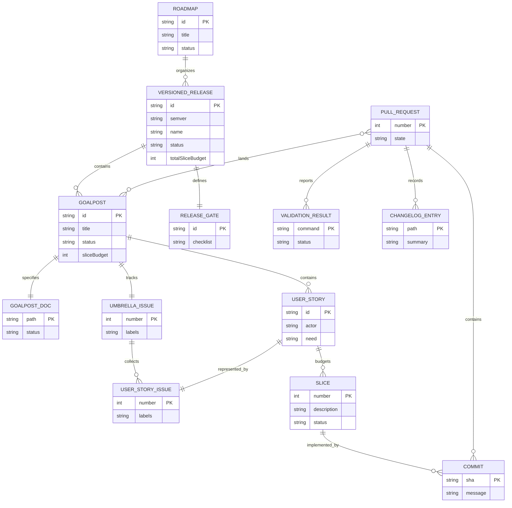
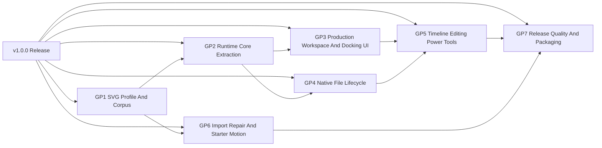
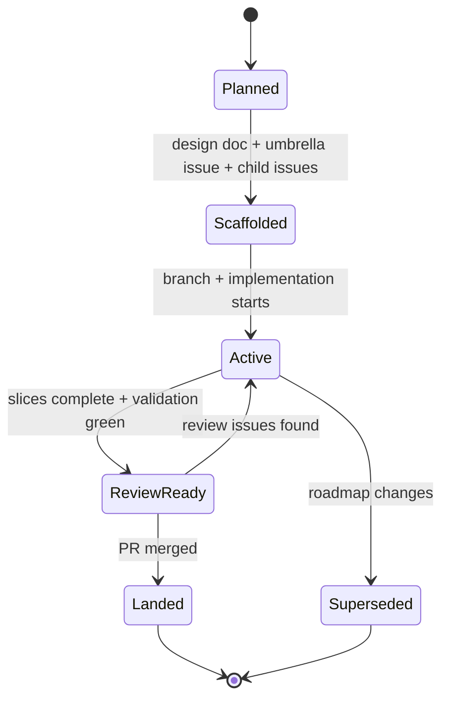

# Roadmap Planning System

## Purpose

Tadpole uses a roadmap-driven, issue-backed, slice-budgeted delivery system.

The system separates intent, coordination, execution, and proof:

- Markdown documents define intent, scope, contracts, and acceptance criteria.
- GitHub Issues coordinate goalposts, user stories, labels, and ownership.
- Branches, commits, and pull requests execute reviewable changes.
- Tests, browser witnesses, generated artifacts, and runtime facts prove
  implementation.

A design document may define intent, but it does not prove implementation. A
goalpost is complete only when the repo can prove the claimed behavior through
an executable or inspectable software surface.

## System Model

| Entity | Purpose | Location |
| --- | --- | --- |
| Roadmap | Orders a release path | Roadmap doc |
| Versioned Release | SemVer product target | Roadmap directory |
| Goalpost | Major milestone | Goalpost doc and umbrella issue |
| Umbrella Issue | Goalpost tracking root | GitHub issue with `goalpost` |
| User Story | User-centered behavior | Child issue and doc section |
| Slice | Reviewable increment | Goalpost checklist |
| Slice Budget | Planning estimate | Roadmap and goalpost docs |
| Acceptance Criteria | Completion contract | Docs and issue bodies |
| Validation Plan | Required proof commands | Design docs and PR bodies |
| Pull Request | Review and merge vehicle | GitHub PR |
| Changelog Entry | Historical ledger | `CHANGELOG.md` |

## Relationship Model

The relationship model is:



The same hierarchy in words is:

```text
Roadmap
  contains versioned releases

Versioned Release
  contains goalposts
  defines release completion gates

Goalpost
  has one design doc
  has one umbrella GitHub issue
  has one slice budget
  contains user stories
  contains a checklist of implementation slices

Umbrella Issue
  represents one goalpost
  collects child user-story issues as GitHub task-list items

User Story Issue
  belongs to one goalpost
  describes one behavior, workflow, or capability
  may be implemented by one or more slices

Slice
  is the smallest useful unit of progress
  should usually map to one test, witness, commit, or reviewable behavior change

Pull Request
  lands one coherent set of docs or implementation changes
  links back to the relevant issue, design doc, and goalpost
```

The canonical planning-to-merge path is:

```text
Roadmap doc
  -> versioned release section
    -> goalpost doc
      -> umbrella issue
        -> child user-story issues
          -> slices
            -> commits
              -> pull request
                -> merge
```

## Versioned Releases

A roadmap organizes goalposts into versioned releases. A versioned release is a
bounded product target with a SemVer release identifier, for example `v1.0.0`.

Release identifiers must use leading-`v` SemVer:

```text
vMAJOR.MINOR.PATCH
```

Versioned release planning has four jobs:

1. Name the release outcome in product terms.
2. Select the goalposts required to call that release complete.
3. Order goalposts by dependency and risk.
4. Define the release gate that must be true before the version can be called
   landed.

The current roadmap instance is the `v1.0.0` completion roadmap:

- Roadmap index:
  `docs/method/design/v1-completion-roadmap/roadmap.md`
- Goalpost docs:
  `docs/method/design/v1-completion-roadmap/gp*.md`
- Umbrella issues:
  `#58` through `#64`
- Planned budget:
  140 slices

### Versioned Release Contract

```text
VersionedRelease = {
  id: "v1.0.0",
  name: "V1.0.0 Completion Roadmap",
  roadmapDoc: MarkdownDocument,
  goalposts: Goalpost[],
  releaseGate: ChecklistItem[],
  totalSliceBudget: PositiveInteger,
  status: "planned" | "active" | "landed" | "superseded"
}
```

### Release Gate

A versioned release is ready when every goalpost in the release is landed and
the release-level gate is satisfied.

For Tadpole `v1.0.0`, the release gate is:

- [ ] Supported SVG animation semantics are documented and fixture-proven.
- [ ] Importer and serializer behavior live in runtime-backed core modules.
- [ ] The workspace is canvas-first, docked, and stable across screen sizes.
- [ ] Open, Save, Save As, dirty-state, and recovery flows feel native.
- [ ] Timeline editing supports high-density animation workflows.
- [ ] Suggested and repaired animation data never masquerades as imported
      source truth.
- [ ] A single validation command and release checklist prove `v1.0.0`
      readiness.

### Release Sequencing



### Version Naming

Use SemVer roadmap names when a body of work has a release-level definition of
complete. Release IDs must include the leading `v` and all three SemVer
positions:

- `v1.0.0`: first version that can reasonably be called complete.
- `v1.1.0`: compatible feature or workflow release after `v1.0.0`.
- `v1.1.1`: patch release for fixes, docs, or proof hardening.
- `v2.0.0`: product or architecture expansion that changes the release
  promise.

Do not use shorthand release IDs such as `v1`, `v1.1`, or `v2` in roadmap
metadata, issue fields, release gates, or release-status reporting. Those forms
may appear only as informal prose when referring to a major release line.

Do not create a new version for every feature. Feature work belongs inside the
current active version unless it changes the release promise.

## Authority Model

Authority flows in this order:

1. Runtime behavior and saved SVG output.
2. Tests, browser witnesses, schema checks, generated artifacts, and command
   output.
3. GitHub Issues and pull requests.
4. Design docs and roadmap docs.
5. Changelog entries.
6. Coordination memory.

Memory notes help coordination, but they do not override files, commits,
commands, GitHub Issues, pull requests, tests, or generated output.

## Goalpost Contract

```text
Goalpost = {
  id: "V1-GP<n>",
  title: string,
  umbrellaIssue: GitHubIssue,
  designDoc: MarkdownDocument,
  sliceBudget: PositiveInteger,
  userStories: UserStory[],
  checklist: Slice[],
  acceptanceCriteria: ChecklistItem[],
  validationPlan: CommandOrWitness[],
  completionState: "planned" | "active" | "landed" | "superseded"
}
```

A goalpost must answer:

- What user or agent outcome does this milestone unlock?
- What inspectable contract exists?
- What is explicitly in scope?
- What is explicitly out of scope?
- Which stories make up the goalpost?
- How many slices are budgeted?
- What must be true before the goalpost is done?
- What tests, witnesses, generated artifacts, or facts prove it?

## User Story Contract

```text
UserStory = {
  issue: GitHubIssue,
  actor: "user" | "agent" | "maintainer" | "designer-engineer",
  need: string,
  reason: string,
  proof: ChecklistItem[],
  sliceBudget: PositiveInteger
}
```

A well-formed story uses this shape:

```text
A <type of user> wants <capability/outcome> so that <reason>,
without having to <current workaround or failure mode>.
```

A user story must name proof. Intent alone is not enough.

## Slice Contract

```text
Slice = {
  number: PositiveInteger,
  description: string,
  expectedProof: "test" | "witness" | "docUpdate" | "issueUpdate" | "runtimeBehavior",
  status: "open" | "inProgress" | "complete"
}
```

A slice is the smallest useful execution unit. A good slice can usually be
reviewed independently and has one obvious proof.

Slice budgets provide progress denominators:

```text
GoalProgress = completed slices / total slices
OverallProgress = landed goalposts / total goalposts
```

Progress reports should use concrete denominators, for example:

```text
Goal 3: [#####-----] 50% (slice 11 of 22)
Overall: [###-------] 30% (goal 3 of 10)
```

## Issue Label Model

Labels are query indexes, not prose decoration.

| Label | Meaning |
| --- | --- |
| `roadmap` | Participates in roadmap planning |
| `goalpost` | Umbrella milestone issue |
| `user-story` | Child issue scoped to a story |
| `work-in-progress` | Current active implementation cycle |
| `enhancement` | Product or capability work |
| `bad-code` | Known technical debt or structural issue |
| `cool-ideas` | Deferred product or design idea |

The important invariant is that `goalpost` and `user-story` should not be mixed
casually. Umbrella issues get `goalpost`; child story issues get `user-story`.

## Workflow State Machines

### Goalpost Lifecycle



### Cycle Lifecycle

```text
sync merge target
  -> create branch
  -> write or update design and issue scaffold
  -> commit scaffold
  -> push branch
  -> open non-draft PR
  -> implement slices
  -> self-review
  -> fix review issues
  -> validate
  -> merge
```

## Proof Policy

No implementation goalpost is complete through documentation alone.

Acceptable proof includes:

- unit tests against runtime modules
- fixture-table tests
- browser witnesses
- Playwright screenshots or flows
- generated SVG roundtrip tests
- schema validation
- deterministic command output
- CI checks
- accessibility and focus witnesses
- inspectable app facts

Docs can explain the contract. They cannot be the only evidence that the
contract works.

## Current Roadmap Instance

| Goalpost | Slice budget | Umbrella issue |
| --- | ---: | --- |
| V1-GP1 SVG Animation Profile And Corpus | 18 | #58 |
| V1-GP2 Runtime Core Extraction | 20 | #59 |
| V1-GP3 Production Workspace And Docking UI | 22 | #60 |
| V1-GP4 Native File Lifecycle | 18 | #61 |
| V1-GP5 Timeline Editing Power Tools | 26 | #62 |
| V1-GP6 Intelligent Import Repair And Starter Motion | 20 | #63 |
| V1-GP7 Release Quality And Packaging | 16 | #64 |

Current release: `v1.0.0`.

Total planned budget: 140 slices.

## Operating Invariants

- Every versioned release has a roadmap document.
- Every versioned release uses leading-`v` SemVer: `vMAJOR.MINOR.PATCH`.
- Every major milestone has a goalpost Markdown document.
- Every goalpost has one umbrella GitHub issue.
- Every umbrella issue collects child user-story issues as checklist items.
- Every child issue maps to a user story, not a vague task.
- Every goalpost has a slice budget.
- Every goalpost doc has a checklist.
- Runtime and product work must have executable proof.
- Markdown docs are planning artifacts, not proof artifacts.
- Changes are committed as normal commits, never amended.
- Branches, commits, and PRs do not use a `codex` prefix.
- PRs are non-draft unless repo policy changes.

## Vision And Bearing Recommendation

Tadpole should keep `BEARING.md` and add a separate `VISION.md`.

### Keep `BEARING.md`

`BEARING.md` already exists and is useful. It should remain the short
operational orientation document:

- what Tadpole is right now
- what recently shipped
- what is currently risky
- what open loops matter next
- what constraints an agent or engineer should remember before touching the
  repo

`BEARING.md` should be updated frequently and should stay factual. It should
not become a product manifesto, backlog, or issue tracker.

### Add `VISION.md`

A root-level `VISION.md` is worth adding because Tadpole now has enough
planning machinery that it needs a stable north star separate from current
state.

`VISION.md` should answer:

- Who is Tadpole for?
- What job should it become excellent at?
- What does "complete" mean from a user's perspective?
- What should Tadpole refuse to become?
- What product principles should guide roadmap tradeoffs?
- Which workflows define success one year from now?

`VISION.md` should change rarely. It should guide release roadmaps without
becoming a roadmap itself.

### Recommended Separation

| Document | Time horizon | Primary question | Update frequency |
| --- | --- | --- | --- |
| `VISION.md` | Long-term | Where are we going? | Rare |
| `BEARING.md` | Current state | Where are we now? | Frequent |
| Roadmap docs | Release cycle | What must land for this version? | Per release |
| Goalpost docs | Milestone | What will this goalpost prove? | Per goalpost |
| GitHub Issues | Execution | What work remains? | Continuous |

The recommendation is to add `VISION.md` in a separate small planning slice,
then tighten `BEARING.md` so it explicitly points to `VISION.md` for long-term
direction and to roadmap docs for release execution.
