<!-- markdownlint-disable-next-line MD025 -->
# G10-G19 - Editor Shell Production UX

## Linked Issue

- [G10-001 - Canvas-First Editor Shell](https://github.com/flyingrobots/tadpole/issues/32)
- [G11-001 - Menu Commands And Document Dialogs](https://github.com/flyingrobots/tadpole/issues/33)
- [G12-001 - Contextual Panels And Panel Host](https://github.com/flyingrobots/tadpole/issues/34)
- [G13-001 - Target Property Timeline Stacks](https://github.com/flyingrobots/tadpole/issues/35)
- [G14-001 - Playback Work Area Controls](https://github.com/flyingrobots/tadpole/issues/36)
- [G15-001 - SVG Native Save Roundtrip](https://github.com/flyingrobots/tadpole/issues/37)
- [G16-001 - Editor Command Model And History](https://github.com/flyingrobots/tadpole/issues/38)
- [G17-001 - Layers Panel Navigation](https://github.com/flyingrobots/tadpole/issues/39)
- [G18-001 - Inspector Editing Surface](https://github.com/flyingrobots/tadpole/issues/40)
- [G19-001 - Keyboard Accessibility Witnesses](https://github.com/flyingrobots/tadpole/issues/41)

## Feature Roadmap

- [G10-G19 feature roadmap](feature-roadmap.md)

## Decision Summary

Tadpole's production UX should become a canvas-first SVG animation editor.
The SVG document is the center of the screen and the source of truth. The
timeline is pinned to the bottom of the viewport because animation editing is
the primary task. Source, export, palette, inspector, warning, and debug
surfaces move behind menus or contextual panels. The editor model may expose
tracks, keyframes, labels, work areas, and debug controls, but save must write
that state back into one SVG file. No project sidecar is allowed.

## Sponsored Human

A designer or engineer wants to open an SVG, see the SVG immediately, select a
part of it, edit its animation on a timeline, preview motion, and save the same
SVG file so that the artifact can travel by itself without a companion project
file.

## Sponsored Agent

An agent needs a deterministic SVG-native document contract, stable command
IDs, inspectable timeline facts, and browser witnesses so it can verify edits
without scraping pixels or inferring private UI state.

## Hill

By the end of this UX cycle, a user can open the Tadpole editor and see a
production-shaped animation workspace: top menu, centered SVG stage,
contextual panels, and a full-width bottom timeline with collapsible target and
property tracks. The design proves the intended UX and API contract with
checked-in SVG mockups, Mermaid diagrams, and acceptance criteria that point
toward browser witnesses.

## Current Truth

- Goal 9's branch currently includes a single-screen editor where most panels
  are visible at once in `frontend/src/App.svelte`.
- Raw SVG import, target discovery, timeline editing, project JSON export,
  runnable HTML export, palette controls, source text, warnings, inspector,
  preview, and timeline are all competing for first-screen attention.
- Goal 9 added safe import of supported SMIL animation into editable tracks and
  warnings for unsupported CSS/Web Animations surfaces.
- The current persisted product contract still includes Tadpole project JSON
  and runnable HTML export surfaces. Production UX should demote those surfaces
  and make saved SVG the primary persisted artifact.

Evidence anchors from the branch this document was authored from:

- [App shell and panels](../../../../frontend/src/App.svelte)
- [Goal 9 design](../svg-timeline-mvp/svg-animation-timeline-import.md)
- [Animation import witness](../../witness/svg-timeline-mvp/animation-import.md)
- [SVG MVP checklist](../svg-timeline-mvp/checklist.md)

## Research Sources

The UX direction is grounded in these primary references:

- [GSAP Timeline documentation](https://gsap.com/docs/v3/GSAP/Timeline/)
- [GSAP GSDevTools documentation](https://gsap.com/docs/v3/Plugins/GSDevTools/)
- [Adobe After Effects animation basics](https://helpx.adobe.com/after-effects/using/animation-basics.html/animation-basics.html)
- [Unity Animation Timeline window reference](https://docs.unity.com/en-us/unity-studio/develop/animation/animation-timeline-ref)
- [Unity Animation Curves manual](https://docs.unity.cn/Manual/animeditor-AnimationCurves.html)

## Research Takeaways

### GSAP Timeline

GSAP's core strength is not only playback. It is the programming model:
animations are children in a timeline, can be placed by absolute time, labels,
or relative offsets, and can be controlled as one object. The Tadpole UI should
adopt this mental model even though the saved output is SVG, not GSAP code.

Important ideas to preserve:

- A timeline is a sequencer, not a bag of independent delays.
- Labels are named positions in time.
- Child animations have identity and can be addressed.
- `to`, `from`, `fromTo`, and `set` map cleanly to authoring commands.
- Defaults reduce repetitive duration/ease configuration.
- `seek`, `play`, `pause`, `reverse`, `restart`, and `timeScale` are primary
  controls.
- Nested timelines are useful conceptually, but Tadpole should start with
  target/property grouping before introducing nested composition.

### GSDevTools

GSDevTools is valuable because it makes animation debug physical: scrubber,
play/pause, loop, time scale, in/out range, keyboard controls, hide/show, and
animation selection. Tadpole should borrow the debug affordances but keep them
native to the editor, not as an add-on panel.

Tadpole should include:

- Space to play/pause.
- In and out markers for a work area.
- Loop toggle for the work area.
- Time scale control for slow review.
- Hide/show timeline stacks without losing keyboard playback.
- A selected-animation menu or filter once multiple timelines/scenes exist.

### After Effects

After Effects' key pattern is a layer/property outline aligned with time. A
layer row can be collapsed while still showing summary key indicators. Expanded
properties show keyframes aligned to the time ruler. Graph Editor mode gives
value/speed visibility when the user needs precision.

Tadpole should include:

- SVG targets as layer-like rows.
- Properties as child rows.
- Collapsed target rows with summary key dots.
- Expanded property rows with keyframe markers and animation spans.
- A future graph mode for numeric properties.
- Stopwatch-like affordance for whether a property is animated.
- Summary warnings when collapsed children contain unsupported or invalid
  imported animation data.

### Unity Animation Editor

Unity's Animation window separates Dopesheet and Curves views. Dopesheet gives
timing control across properties; Curves provides value shape. Unity also puts
objects/properties in a left list and keyframes in the timeline area, with a
handle/playhead for preview and insertion.

Tadpole should include:

- Dopesheet as the default timeline mode.
- Curves mode as a future advanced mode for numeric tracks.
- A property list aligned to keyframes.
- A playhead handle that both scrubs and defines insertion time.
- A seconds/frames toggle.
- Keyframe add, drag, multi-select, and delete semantics.

## Problem

The current UI proves capability but does not yet look or behave like a
production animation editor. It asks the user to inspect a workbench full of
source text, export payloads, palette controls, and state panels before the SVG
itself becomes the center of attention.

Good production animation UX should make this path dominant:

1. Open SVG.
2. See SVG.
3. Select target.
4. See the target's tracks.
5. Edit keys on the timeline.
6. Preview motion.
7. Save the SVG.

Everything else should be secondary chrome.

## Non-Negotiable Invariants

- The saved document is one SVG file.
- No required project JSON sidecar.
- No required asset bundle.
- No required external CSS or JavaScript file.
- Animation truth must be readable from the SVG itself.
- Optional Tadpole metadata may live inside the SVG, but it cannot be the only
  representation of motion when a standard SVG animation node can represent it.
- Runnable HTML export is a generated review artifact, not persisted project
  state.
- The editor model is allowed to be richer than the SVG DOM while the document
  is open, but save must serialize back into the SVG.

## Design Principles

### Canvas First

The SVG stage owns the visual center. Panels may flank or overlay the canvas,
but the first viewport must always communicate that the user is editing an SVG,
not a form.

### Timeline Always Present

The timeline is pinned to the bottom. It may collapse track stacks, hide
property rows, or switch modes, but the time ruler and playback controls remain
available.

### Menus Hide Secondary Surfaces

Raw SVG source, export payloads, project/debug facts, palette controls, and
warnings are not default panels. They are menu commands or contextual overlays.

### Tracks Are SVG Targets And Properties

The visible hierarchy is:

```text
SVG document
target row: #ui UI Text
property row: transform.x
keyframes on the property row
```

Target rows organize SVG elements and groups. Property rows own animation
curves/spans. Keyframes are points on property rows.

### Commands Mutate The Editor Model

UI controls dispatch command intents. Commands update an editor model. Effects
render previews and serialize SVG output from that model.

### SVG Serialization Is Explicit

Save is not "dump app state." Save is a deterministic serialization pass that:

- removes stale Tadpole-authored animation nodes,
- writes current track/keyframe state as SVG animation nodes,
- updates optional embedded editor metadata,
- preserves safe non-animation SVG content,
- reports unsupported states before writing.

## Primary Mockups

### Wide Editor Shell

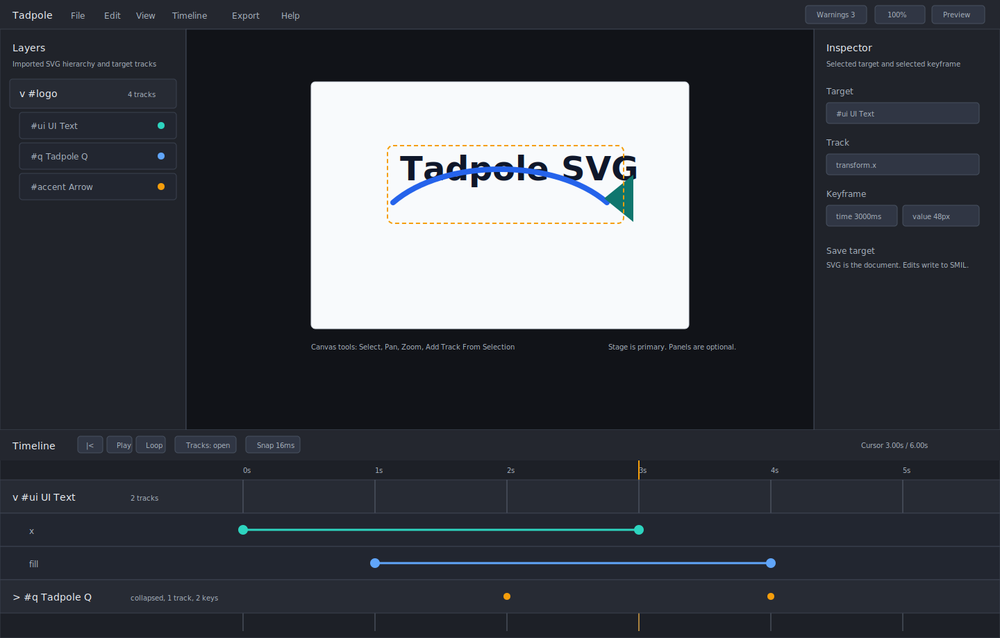

The default wide layout has:

- top menu and status bar,
- optional left Layers panel,
- centered SVG stage,
- optional right Inspector panel,
- full-width pinned timeline,
- track rows grouped by SVG target and property.

### Collapsible Timeline Stack

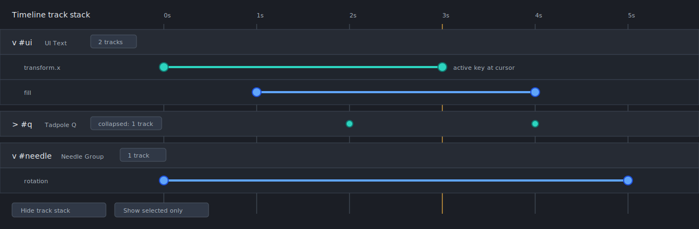

The timeline supports target rows and property rows. Collapsed target rows show
summary key dots and counts; expanded targets show property tracks.

### File Menu

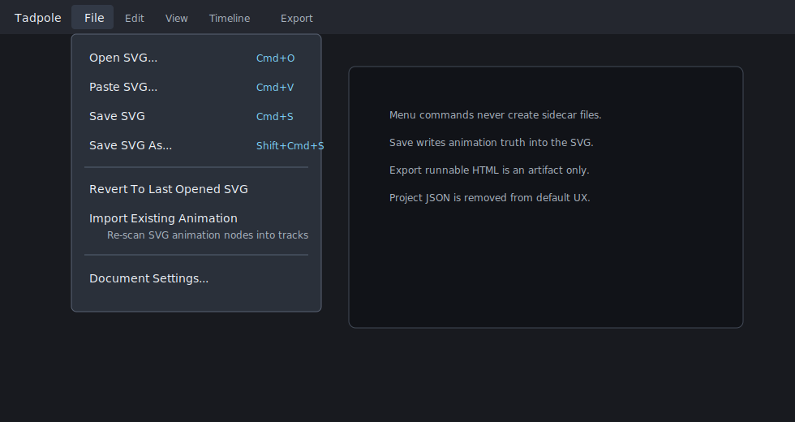

The File menu owns document actions. It does not expose project JSON as a
default workflow.

### Open SVG Dialog

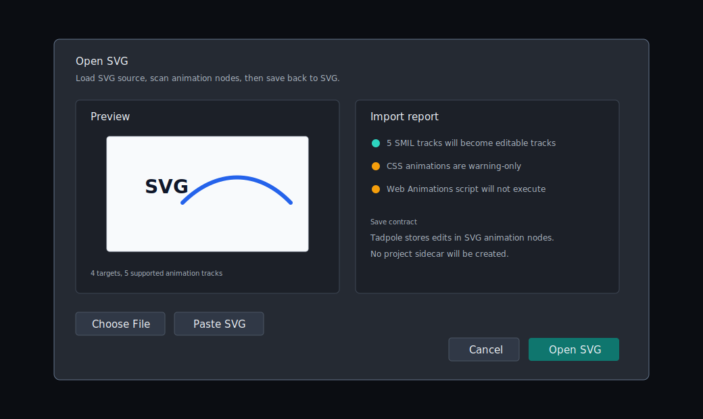

The import dialog previews target count, supported track count, and warning
count before the SVG becomes the active document.

### Save And Export Dialog

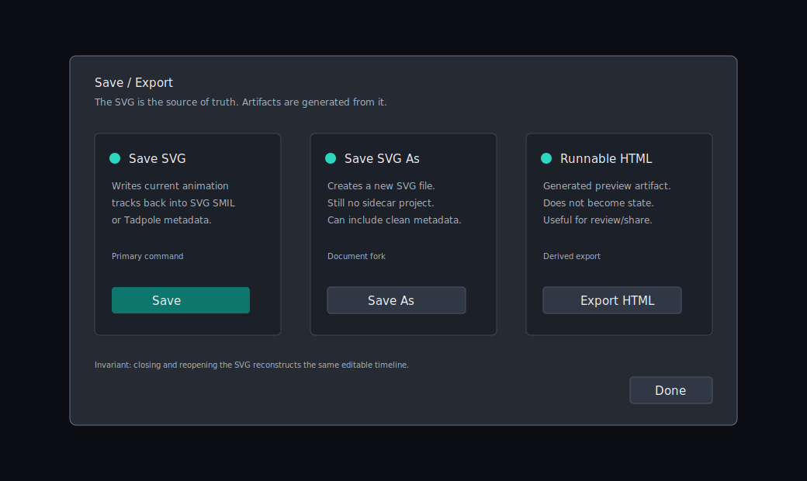

Save writes SVG. Export creates derived artifacts.

### Context Panels

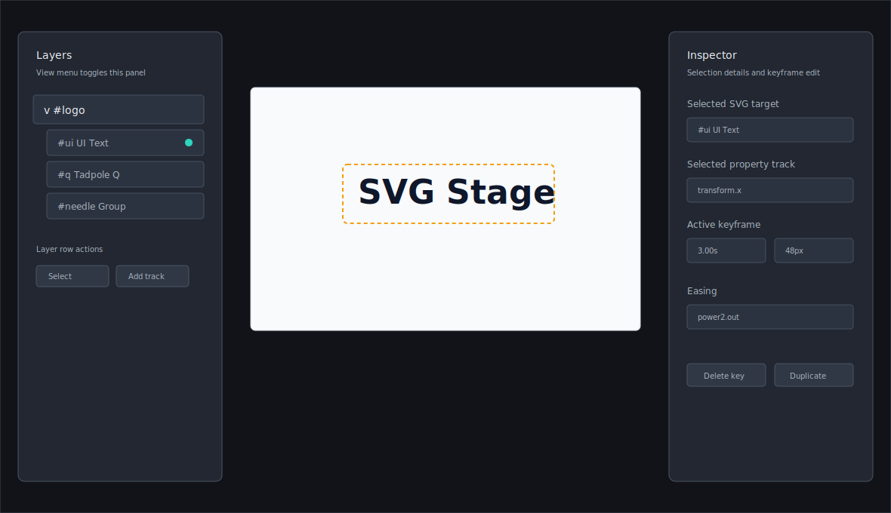

Layers and Inspector are contextual. They can be toggled from View or by active
tool state.

### Component Sheet

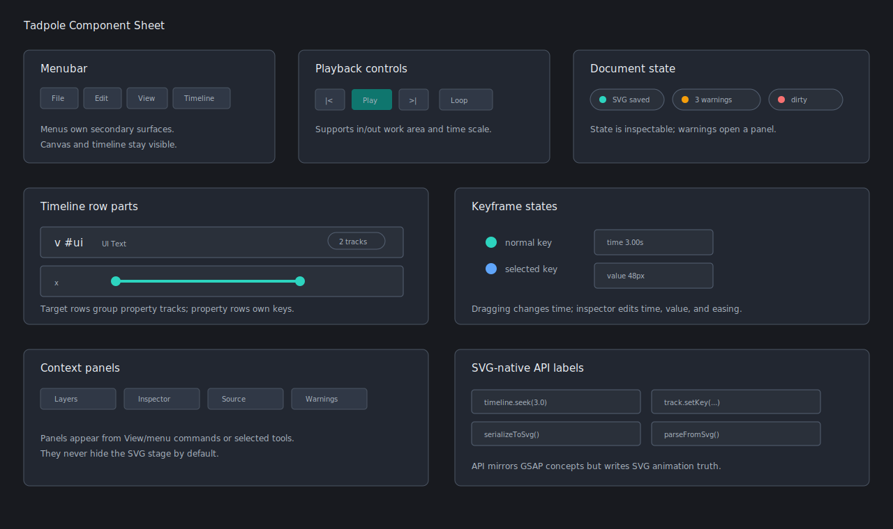

The component sheet names reusable menu, playback, panel, timeline, keyframe,
and document-state parts.

## Screen Architecture

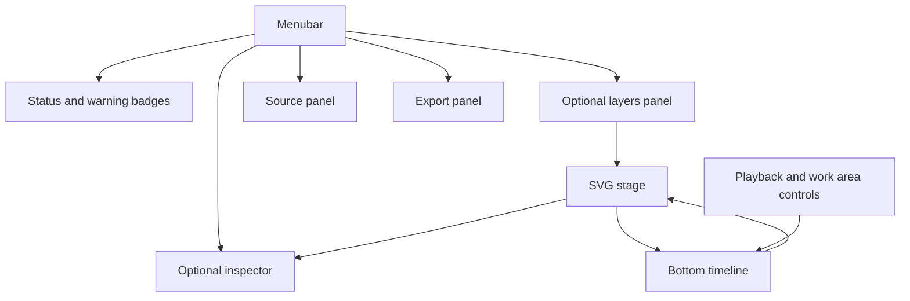

## Default Layout

The default viewport should be:

```text
+--------------------------------------------------+
| Menubar: File Edit View Timeline Export Help     |
+--------------------------------------------------+
|                                                  |
|                  SVG Stage                       |
|          selection overlays and tool HUD         |
|                                                  |
+--------------------------------------------------+
| Target/property timeline rows                    |
+--------------------------------------------------+
| Time ruler, playhead, work area, playback        |
+--------------------------------------------------+
```

Default visible components:

- Menubar.
- Document status badges.
- SVG stage.
- Target selection overlay.
- Bottom timeline.
- Playback controls.
- Current time/duration.
- Warning badge if warnings exist.

Default hidden components:

- Raw SVG source.
- Project JSON.
- Runnable HTML output.
- Palette controls.
- Full inspector.
- Full layer tree.
- Full warning list.
- Debug facts.

## Menu Model

### File

Commands:

- `file.openSvg`: open an SVG file.
- `file.pasteSvg`: open a modal paste surface.
- `file.saveSvg`: serialize current animation into the active SVG.
- `file.saveSvgAs`: save to a new SVG file.
- `file.revertSvg`: reload the last opened SVG snapshot.
- `file.importAnimation`: re-scan animation nodes into tracks.
- `file.documentSettings`: open document duration, frame rate, and metadata.

Rules:

- `Save SVG` is the primary persistence command.
- `Open SVG` replaces the current document after dirty-state confirmation.
- `Import Animation` reads from the current SVG and rebuilds editable tracks.
- Project JSON is not a primary menu item in production UX.

### Edit

Commands:

- `edit.undo`
- `edit.redo`
- `edit.cutKeys`
- `edit.copyKeys`
- `edit.pasteKeys`
- `edit.duplicateTrack`
- `edit.deleteSelection`
- `edit.selectAllKeys`
- `edit.selectAnimatedTargets`
- `edit.preferences`

Rules:

- Undo/redo must eventually cover import, target selection, key editing,
  track creation, and serialization-affecting commands.
- Deleting a target row's animation deletes its track animation nodes on save,
  not the SVG element itself.

### View

Commands:

- `view.showLayers`
- `view.showInspector`
- `view.showSource`
- `view.showWarnings`
- `view.showExport`
- `view.fitCanvas`
- `view.actualSize`
- `view.zoomIn`
- `view.zoomOut`
- `view.toggleGrid`
- `view.toggleReducedChrome`

Rules:

- Panels are overlays or side docks.
- The SVG stage remains visible while panels are open on desktop.
- On narrow screens, panels may become modal sheets.

### Timeline

Commands:

- `timeline.playPause`
- `timeline.stop`
- `timeline.seekStart`
- `timeline.seekEnd`
- `timeline.previousKey`
- `timeline.nextKey`
- `timeline.addKey`
- `timeline.deleteKey`
- `timeline.setInPoint`
- `timeline.setOutPoint`
- `timeline.clearWorkArea`
- `timeline.toggleLoop`
- `timeline.toggleTrackStack`
- `timeline.showSelectedOnly`
- `timeline.modeDopesheet`
- `timeline.modeCurves`
- `timeline.toggleFramesSeconds`
- `timeline.snapSettings`

Rules:

- Dopesheet is the default mode.
- Curves mode is an explicit advanced mode.
- Track stack collapse never hides the time ruler or playback controls.
- In/out points define a review work area, not document duration.

### Export

Commands:

- `export.saveSvg`
- `export.optimizedSvg`
- `export.runnableHtml`
- `export.copyInlineSvg`
- `export.copyAnimationSummary`

Rules:

- `Save SVG` remains the primary export path.
- Runnable HTML is a derived artifact.
- Optimized SVG may remove Tadpole editor metadata only if the user confirms.

### Help

Commands:

- `help.shortcuts`
- `help.svgContract`
- `help.animationSupport`
- `help.about`

## Tool Model

Initial tools:

- Select target.
- Pan canvas.
- Zoom canvas.
- Add track from selected target.
- Edit keyframe.
- Scrub timeline.

Future tools:

- Multi-select targets.
- Motion path edit.
- Curve tangent edit.
- Layer tree reparenting if safe.

Tool behavior:

- Selecting a target updates the Inspector and filters the timeline to that
  target's row.
- Selecting a property row updates the Inspector to property/keyframe controls.
- Dragging on the timeline manipulates time or selected keys.
- Dragging on the canvas manipulates selected target values only when an edit
  tool is active.

## Timeline UX

### Timeline Rows

Target row:

- displays SVG ID,
- displays friendly target label,
- shows SVG kind,
- shows track count,
- shows key count,
- shows warning badge if child tracks have unsupported import state,
- expands/collapses property rows.

Property row:

- displays property name,
- owns keyframe markers,
- displays span between keyframes,
- shows current value at playhead,
- supports drag-to-move keyframes,
- supports double-click to add keyframe.

Collapsed target row:

- hides property rows,
- keeps summary key dots,
- shows count badge,
- remains selectable.

### Keyframe Markers

Keyframe states:

- normal,
- selected,
- hovered,
- dragged,
- invalid value,
- imported,
- unsaved.

Marker shape proposal:

- circle for linear/default,
- diamond for eased,
- square for hold/discrete,
- hollow marker for imported but unedited,
- filled marker for user-authored or edited.

### Animation Spans

Spans connect adjacent keyframes on the same property row.

Span states:

- linear,
- eased,
- hold/discrete,
- muted track,
- selected span,
- unsupported or partially imported.

Span rendering:

- line between keyframes in Dopesheet mode,
- curve segment in Curves mode,
- muted state as low-opacity dashed line.

### Time Ruler

Required controls:

- seconds/frames toggle,
- zoom level,
- snap step,
- work area in/out markers,
- current playhead time,
- document duration.

### Work Area

GSDevTools-style in/out markers are valuable enough to make first-class.

Commands:

- `I`: set in point to playhead.
- `O`: set out point to playhead.
- double-click marker: clear work area.
- loop toggle loops current work area when present.

Persistence:

- Work area may be stored in embedded Tadpole metadata.
- Work area is editor metadata, not animation truth.

## Dialogs

### Open SVG

Fields:

- file picker,
- paste SVG area,
- preview thumbnail,
- target count,
- supported animation track count,
- unsupported warning count,
- save-contract notice.

Actions:

- Open SVG.
- Cancel.
- Show import details.

Validation:

- invalid SVG error,
- unsafe content warning,
- unsupported animation warning,
- targetless SVG empty state.

### Save SVG

Fields:

- destination name,
- dirty-state summary,
- animation node summary,
- optional editor metadata checkbox,
- unsupported state warnings.

Actions:

- Save.
- Save As.
- Cancel.
- Export optimized SVG.

### Export Runnable HTML

Fields:

- artifact filename,
- active tracks,
- runtime mode,
- loop setting,
- warning summary.

Actions:

- Copy HTML.
- Download HTML.
- Preview in new tab.

This dialog is secondary. It should not be visible by default.

### Warnings

Fields:

- import warnings,
- serialization warnings,
- unsafe content removals,
- unsupported animation nodes,
- missing target IDs.

Actions:

- reveal source node when possible,
- copy report,
- dismiss resolved warning,
- open help for animation support.

## User Journey

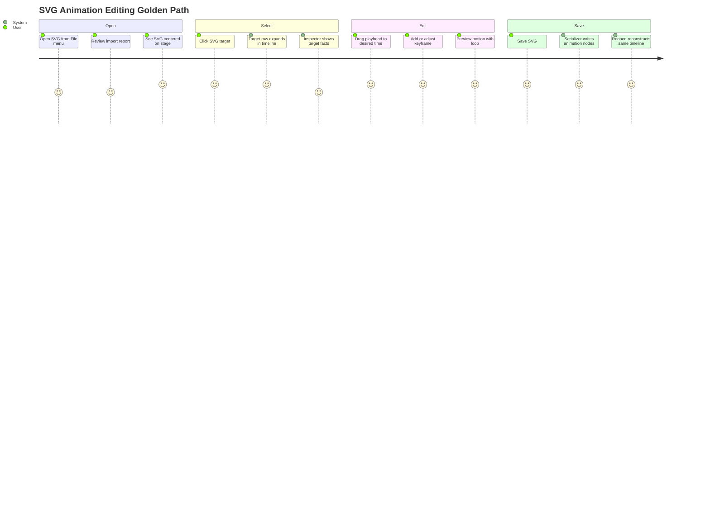

## Alternative Flows

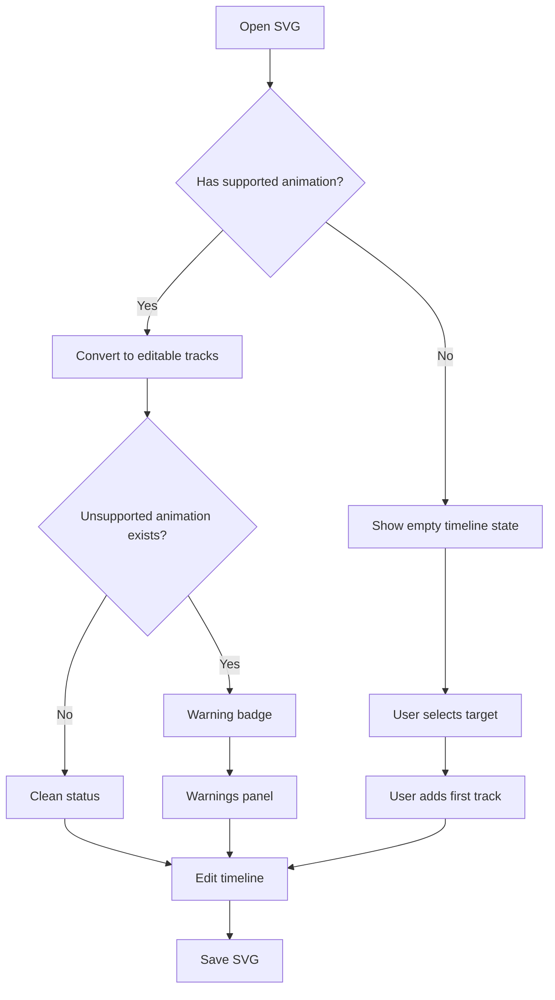

## State Model

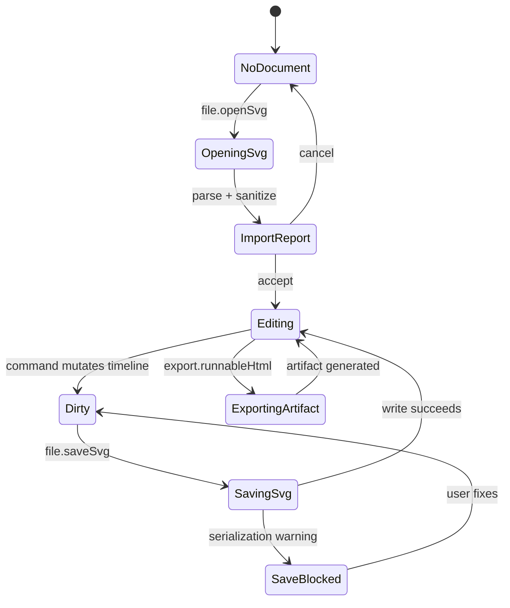

## Panel State

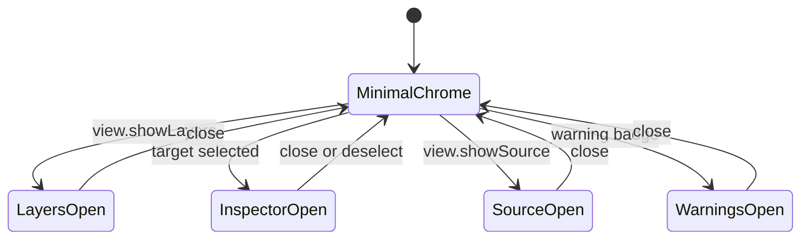

## Entity Relationship

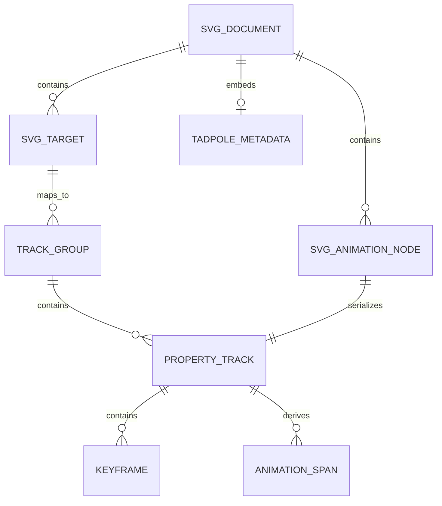

## Class Model

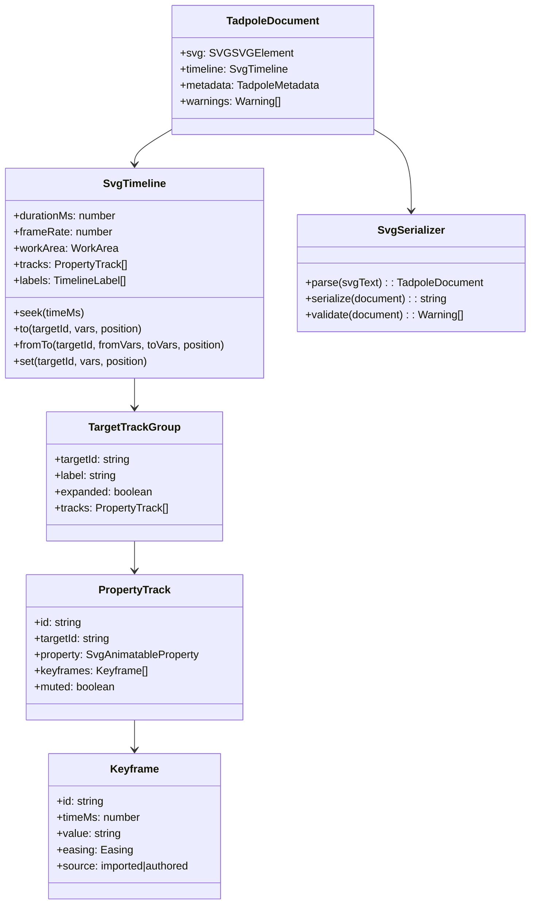

## API-Level Design

The API should feel familiar to GSAP users while remaining SVG-native.

### Public Editor Commands

```ts
type TadpoleCommand =
  | { type: "file.openSvg"; source: string; label: string }
  | { type: "file.saveSvg" }
  | { type: "timeline.seek"; timeMs: number }
  | { type: "timeline.playPause" }
  | { type: "timeline.setWorkArea"; inMs: number; outMs: number }
  | { type: "target.select"; targetId: string }
  | { type: "track.add"; targetId: string; property: SvgAnimatableProperty }
  | { type: "track.remove"; trackId: string }
  | { type: "keyframe.set"; trackId: string; timeMs: number; value: string }
  | {
      type: "keyframe.move";
      trackId: string;
      keyframeId: string;
      timeMs: number;
    }
  | { type: "keyframe.delete"; trackId: string; keyframeId: string };
```

### GSAP-Inspired Authoring API

This API is for internal use, tests, and future scripting. It should not
persist as JavaScript. It serializes to SVG.

```ts
const doc = Tadpole.openSvg(svgText);

doc.timeline
  .to("#ui", { x: 48, duration: 900, ease: "power2.out" }, 0)
  .to("#ui", { fill: "#2563eb", duration: 600 }, "accent")
  .addLabel("accent", 450)
  .seek(3000);

const savedSvg = doc.serializeToSvg();
```

Semantics:

- `target` is an SVG ID selector.
- `position` is absolute milliseconds, seconds, label, or relative label.
- `duration` becomes keyframe spacing.
- `ease` becomes SVG-compatible timing metadata where possible.
- Unsupported easing must either map to supported SVG spline timing or be
  stored as Tadpole metadata with a warning.

### Editor Store Shape

```ts
type TadpoleEditorState = {
  document: TadpoleDocumentState;
  selection: SelectionState;
  viewport: ViewportState;
  panels: PanelState;
  playback: PlaybackState;
  history: CommandHistoryState;
};
```

Only `document` is serialized into SVG. `selection`, `viewport`, `panels`, and
`history` are runtime state unless explicitly stored as optional editor
metadata.

## SVG-Native Persistence Contract

### Required Save Contract

Saving an SVG performs this sequence:

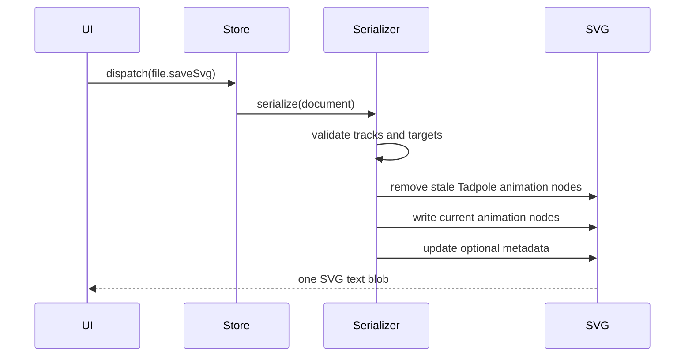

### Animation Node Strategy

Primary motion should be represented with standard SVG animation nodes:

| Tadpole property | Preferred SVG output |
| ---------------- | -------------------- |
| `x` | `<animateTransform type="translate">` |
| `y` | `<animateTransform type="translate">` |
| `scale` | `<animateTransform type="scale">` |
| `rotation` | `<animateTransform type="rotate">` |
| `opacity` | `<animate attributeName="opacity">` |
| `fill` | `<animate attributeName="fill">` |
| `stroke` | `<animate attributeName="stroke">` |
| `strokeWidth` | `<animate attributeName="stroke-width">` |

Open question:

- Multiple transform component tracks can conflict in plain SMIL. The first
  production serializer must define whether it combines transform components
  into one transform animation, uses additive transform nodes, or stores a
  Tadpole-authored transform metadata block and emits a compatibility warning.

### Embedded Metadata

Allowed embedded metadata:

- Tadpole editor version.
- Friendly target labels.
- Track IDs.
- Timeline labels.
- Work area.
- UI grouping state.
- Unsupported easing names.
- Source import warnings.

Not allowed as the only source of motion:

- keyframe times,
- keyframe values,
- animated property identity,
- target identity.

If the SVG cannot represent a motion feature as standard animation, Tadpole
must either:

- block save with a clear warning,
- degrade to a supported SVG representation with user confirmation,
- or store metadata plus a visible compatibility warning.

### Metadata Example

```xml
<metadata id="tadpole-editor-state" data-tadpole-version="1">
  {
    "labels": [{"name": "accent", "timeMs": 450}],
    "workArea": {"inMs": 0, "outMs": 900},
    "groups": [{"targetId": "ui", "expanded": true}]
  }
</metadata>
```

## Data Flow

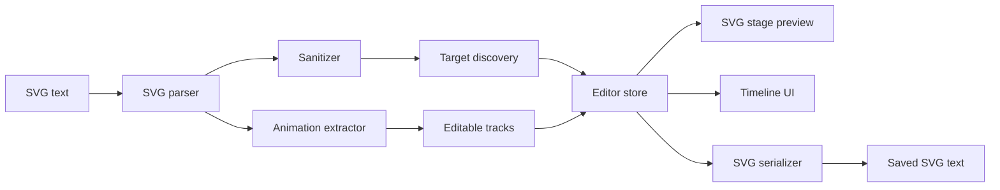

## Accessibility Contract

Required accessibility surfaces:

- Menubar follows keyboard menu expectations.
- Canvas target selection has a non-pointer alternative via Layers panel.
- Timeline rows are navigable by keyboard.
- Keyframes are focusable controls.
- Playhead time is exposed as text.
- Warning badge has count and opens a textual warning list.
- Drag operations have keyboard alternatives:
  - move selected keyframe one frame,
  - move selected keyframe ten frames,
  - add keyframe at playhead,
  - delete selected keyframe.

## Keyboard Model

Initial keyboard commands:

| Key | Command |
| --- | ------- |
| Space | Play or pause |
| Home | Seek start |
| End | Seek end |
| Left/Right | Step one frame |
| Shift+Left/Right | Step ten frames |
| K | Add keyframe at playhead |
| Delete | Delete selected keyframe or selected track |
| I | Set work area in point |
| O | Set work area out point |
| L | Toggle loop |
| H | Hide/show timeline stack |
| Cmd/Ctrl+S | Save SVG |
| Cmd/Ctrl+O | Open SVG |

## Inspector Model

Inspector modes:

- No selection: document facts.
- Target selected: target ID, name, kind, track creation actions.
- Track selected: property, target, key count, easing defaults.
- Keyframe selected: time, value, easing, source, warning state.
- Warning selected: source node, reason, possible mitigation.

Inspector should never be required for common keyframe timing edits. The
timeline itself must support add, select, drag, and delete.

## Layers Panel Model

Layer tree rows show:

- SVG hierarchy,
- target ID,
- friendly name,
- kind,
- track count,
- warning count,
- visibility/mute state for animation preview,
- selection state.

Layer tree interactions:

- click selects target,
- double-click focuses target in canvas,
- context menu adds track,
- search filters by ID/name/kind,
- badges reveal warning details.

## Timeline Mode Details

### Dopesheet Mode

Default mode. Optimized for timing.

Shows:

- keyframe positions,
- spans between keys,
- collapsed target summaries,
- selected playhead,
- work area.

Does not show:

- numeric value curves,
- Bezier handles,
- value axis.

### Curves Mode

Advanced mode. Optimized for value shape.

Shows:

- selected numeric property curves,
- value axis,
- Bezier handles or equivalent easing handles,
- speed/value graph toggle.

Initial scope:

- design only,
- not required for first editor-shell implementation.

## Component Inventory

### App Shell

- `EditorShell`
- `MenuBar`
- `DocumentStatusBar`
- `CanvasStage`
- `PanelHost`
- `BottomTimeline`
- `PlaybackBar`

### Menus

- `FileMenu`
- `EditMenu`
- `ViewMenu`
- `TimelineMenu`
- `ExportMenu`
- `HelpMenu`

### Panels

- `LayersPanel`
- `InspectorPanel`
- `SourcePanel`
- `WarningsPanel`
- `ExportPanel`
- `DocumentSettingsPanel`

### Timeline Components

- `TimelineRuler`
- `WorkAreaMarker`
- `Playhead`
- `TargetTrackRow`
- `PropertyTrackRow`
- `KeyframeMarker`
- `AnimationSpan`
- `TimelineZoomControl`
- `DopesheetMode`
- `CurvesMode`

### Dialog Components

- `OpenSvgDialog`
- `PasteSvgDialog`
- `SaveSvgDialog`
- `ExportRunnableDialog`
- `UnsavedChangesDialog`
- `AnimationSupportDialog`

## Implementation Slices

This design intentionally proposes an implementation path separate from this
documentation-only cycle:

- Slice 1: Extract editor model and commands from the monolithic Svelte
  component.
- Slice 2: Add `EditorShell`, `MenuBar`, `CanvasStage`, and `BottomTimeline`
  layout with existing behavior preserved.
- Slice 3: Move SVG source, project, runnable export, warnings, and palette
  controls behind menus or contextual panels.
- Slice 4: Rebuild timeline rows as target/property stacks with collapse,
  keyframe markers, spans, playhead, and ruler.
- Slice 5: Add SVG-native save path that serializes editable tracks back into
  SVG animation nodes.
- Slice 6: Add browser witnesses for open, edit, collapse timeline, save SVG,
  reopen SVG, and export runnable artifact.

## Tests To Write First

- [ ] Browser witness: default app opens with SVG stage centered and secondary
      panels hidden.
- [ ] Browser witness: menu opens Source panel without losing stage or timeline.
- [ ] Browser witness: imported animation tracks appear as target/property
      timeline rows.
- [ ] Browser witness: timeline target row collapse preserves summary key dots.
- [ ] Browser witness: Save SVG writes animation nodes into a single SVG file.
- [ ] Parser/serializer test: saved SVG reopens to the same editable timeline.
- [ ] Accessibility test: timeline keyframe markers are keyboard reachable.

## Acceptance Criteria

- [ ] SVG stage is the primary visual element in the first viewport.
- [ ] Timeline is pinned to the bottom and full-width.
- [ ] Track stacks can expand and collapse.
- [ ] Secondary panels are hidden by default and opened by menu/tool state.
- [ ] File menu has SVG-native open/save commands.
- [ ] Save contract writes to one SVG file with no sidecar.
- [ ] Existing import/edit/preview/export workflows remain reachable.
- [ ] Warnings remain visible through a badge even when warning panel is hidden.
- [ ] Browser witnesses prove the golden path.

## Validation Plan

For this design document:

```bash
npx --yes markdownlint-cli2 \
  docs/method/design/editor-shell-production-ux/design.md
git diff --check
```

For the future implementation:

```bash
npm run check
npm run build
node docs/method/witness/editor-shell-production-ux/editor-shell-smoke.mjs
node docs/method/witness/editor-shell-production-ux/svg-save-roundtrip-smoke.mjs
```

## Follow-On Issues

- [G10-001 - Canvas-First Editor Shell](https://github.com/flyingrobots/tadpole/issues/32)
- [G11-001 - Menu Commands And Document Dialogs](https://github.com/flyingrobots/tadpole/issues/33)
- [G12-001 - Contextual Panels And Panel Host](https://github.com/flyingrobots/tadpole/issues/34)
- [G13-001 - Target Property Timeline Stacks](https://github.com/flyingrobots/tadpole/issues/35)
- [G14-001 - Playback Work Area Controls](https://github.com/flyingrobots/tadpole/issues/36)
- [G15-001 - SVG Native Save Roundtrip](https://github.com/flyingrobots/tadpole/issues/37)
- [G16-001 - Editor Command Model And History](https://github.com/flyingrobots/tadpole/issues/38)
- [G17-001 - Layers Panel Navigation](https://github.com/flyingrobots/tadpole/issues/39)
- [G18-001 - Inspector Editing Surface](https://github.com/flyingrobots/tadpole/issues/40)
- [G19-001 - Keyboard Accessibility Witnesses](https://github.com/flyingrobots/tadpole/issues/41)
- [#24 - Suggest starter timelines for static SVGs](https://github.com/flyingrobots/tadpole/issues/24)
- [#25 - Multi-select SVG targets for batch editing](https://github.com/flyingrobots/tadpole/issues/25)

## Retrospective

What changed from the design:

- TBD

What the tests proved:

- TBD

What remains open:

- TBD
