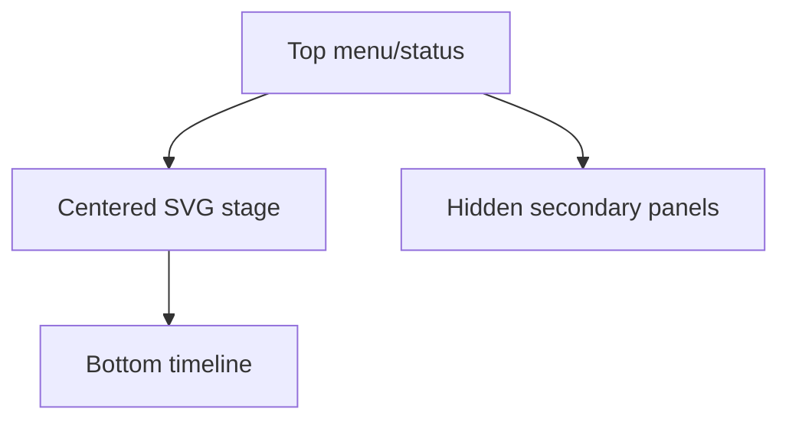

<!-- markdownlint-disable-next-line MD025 -->
# G10-001 - Canvas-First Editor Shell

## Linked Issue

- [G10-001 - Canvas-First Editor Shell](https://github.com/flyingrobots/tadpole/issues/32)

## Roadmap Gate

- Goal 10: Canvas-First Editor Shell

## Cycle Start

- [x] `git fetch origin` completed.
- [x] Local merge target branch synced to `origin/main` by regular merge.
- [x] Cycle branch checked out.
- [x] GitHub issue created.
- [x] `work-in-progress` label applied when implementation starts.
- [x] Design doc, issue link, and initial cycle scaffold staged and committed.
- [x] Branch pushed and non-draft PR opened to the merge target.

## Decision Summary

Goal 10 makes the first production editor shape real without changing the
underlying animation model: the default viewport shows a top-level editor shell,
centered SVG stage, document status, and a bottom-pinned timeline while current
import/edit/preview behavior remains intact.

## Sponsored Human

A designer or engineer wants to open Tadpole and immediately see the SVG as the
center of work so that animation edits feel direct, without scanning source,
export, palette, and debug panels first.

## Sponsored Agent

An agent needs stable shell landmarks and stage/timeline selectors so it can
verify layout and workflow reachability without inferring visual hierarchy from
pixels alone.

## Hill

By the end of this cycle, a user can open Tadpole into a canvas-first editor
shell through the default route, and the repo proves it with a browser witness
that asserts shell landmarks, stage prominence, bottom timeline placement, and
existing workflow reachability.

## Current Truth

- `frontend/src/App.svelte` currently owns the app shell and most editor
  behavior.
- Goal 9 proves SVG animation import and editing, but the workbench still shows
  too many secondary surfaces by default.
- Parent design: [Editor Shell Production UX](../design.md).
- Mockup: [Wide editor shell](../mockups/editor-shell-wide.svg).

## Problem

The editor has the core SVG animation capability but does not yet communicate
"edit the SVG first." Secondary panels crowd the first viewport and reduce the
SVG stage to one panel among many.

## Scope

This cycle includes:

- Shell landmarks for menubar, status, stage, panel host, and bottom timeline.
- Canvas-stage layout that keeps the SVG visually centered.
- Bottom-pinned timeline region using existing timeline behavior.
- Hidden-by-default placement for secondary surfaces where safe.
- Browser witness for wide and narrow default layout.

## Non-Goals

This cycle does not include:

- Rebuilt target/property timeline rows.
- SVG-native save serialization.
- Full menu/dialog command model.
- Layers or Inspector feature completion.

## User Experience / Product Shape

The first screen presents Tadpole as an editor, not as a debug workbench. The
SVG stage owns the visual center, document status appears near the top, and the
timeline remains available at the bottom.



## Runtime / API Contract

Required stable surfaces:

- `[data-tadpole-editor-shell]`
- `[data-tadpole-canvas-stage]`
- `[data-tadpole-document-status]`
- `[data-tadpole-panel-host]`
- `[data-tadpole-bottom-timeline]`

Existing import, preview, selection, playback, and export state must remain
reachable through current state contracts.

## Data / State / Schema Model

No persisted schema change. Runtime layout state may record whether reduced
chrome or panel overlays are open, but document animation truth remains in the
current timeline state.

## Security / Trust Boundary

No new SVG trust boundary. Existing sanitizer/import behavior must remain
unchanged and covered by existing SVG import witnesses.

## Accessibility Posture

| Surface | Requirement |
| ------- | ----------- |
| Shell | Landmarks or labelled regions identify menu, stage, and timeline. |
| Stage | SVG target selection remains reachable by existing controls. |
| Timeline | Playback controls remain keyboard reachable. |
| Status | Warning/dirty state is exposed as text, not only color. |

## Localization / Directionality Posture

New shell labels are user-visible strings. Keep copy short, colocated in
`App.svelte` for this cycle, and avoid direction-dependent layout assumptions.

## Agent Inspectability

Browser witnesses assert stable selectors, visible/hidden panel state, stage
bounding box dominance, and bottom timeline presence.

## Linked Invariants

- Runtime behavior is the proof.
- The SVG remains the center of the production UX.
- Browser witness coverage is required for visual editor workflows.
- SVG import trust boundaries remain unchanged.

## Alternatives Considered

### Option A: Rebuild Entire UX At Once

Pros:

- Fewer temporary shell states.

Cons:

- Too much behavior moves in one PR.

### Option B: Shell First, Preserve Behavior

Pros:

- Produces immediate UX direction with limited behavioral risk.
- Creates layout anchors for later goals.

Cons:

- Some old controls may remain internally coupled for one cycle.

## Decision

Choose Option B. Goal 10 establishes the visible editor frame while preserving
existing behavior.

## Implementation Slices

- [x] Slice 1: Add shell landmarks and test selectors around existing regions.
- [x] Slice 2: Center the SVG preview inside a dedicated canvas stage.
- [x] Slice 3: Pin the current timeline region to the bottom of the viewport.
- [x] Slice 4: Add compact document status badges.
- [x] Slice 5: Add wide and narrow browser layout witness.

## Tests To Write First

- [x] Browser witness: default route exposes shell/stage/timeline landmarks.
- [x] Browser witness: secondary panels are not first-viewport defaults.
- [x] Browser witness: existing SVG import/edit path still works.

## Proof Matrix

| Claim | Required proof |
| ----- | -------------- |
| Stage is the dominant surface | Browser bounding-box assertion |
| Timeline is bottom-pinned | Browser layout assertion |
| Existing workflows remain reachable | Import/edit smoke path |

## Acceptance Criteria

- [x] SVG stage is the primary visual element in the first viewport.
- [x] Timeline is pinned to the bottom.
- [x] Status badges expose warning and dirty state.
- [x] Existing import/edit/preview workflows still pass.
- [x] Local validation is green.

## Validation Plan

```bash
npm run check
npm run build
node docs/method/witness/editor-shell-production-ux/editor-shell-smoke.mjs
```

## Playback / Witness

Run the app and execute `editor-shell-smoke.mjs` against a wide and narrow
viewport.

## Open Questions

- @flyingrobots: Should old right-column controls be hidden immediately, or
  placed behind a temporary menu during this cycle? Decide during
  implementation.

## Follow-On Issues

- [Goal 11 menus](https://github.com/flyingrobots/tadpole/issues/33)
- [Goal 13 timeline stacks](https://github.com/flyingrobots/tadpole/issues/35)

## Retrospective

What changed from the design:

- The shell was implemented as a stacked cycle on the editor-shell design branch
  because the Goal 10-19 roadmap was not yet merged to `main`.
- Secondary source, target, export, palette, workspace, and font surfaces moved
  behind top menu commands.
- The current preview and timeline behavior was preserved inside the new shell
  instead of splitting the Svelte monolith during this cycle.
- Narrow view hides the legacy playback toolbar so the SVG stage remains
  visible in the first viewport.

What the tests proved:

- `editor-shell-smoke.mjs` proves shell landmarks, hidden default panels,
  centered stage dominance, bottom timeline placement, and import/edit/export
  reachability.
- Existing SVG import, project export, runnable export, rough UX, and animation
  import witnesses were updated to open hidden panels through menu commands.

What remains open:

- Goal 11 should convert the temporary top command bar into a fuller menu and
  dialog model.
- Goal 13 should rebuild timeline rows as target/property stacks instead of
  polishing the current track-card list further.
