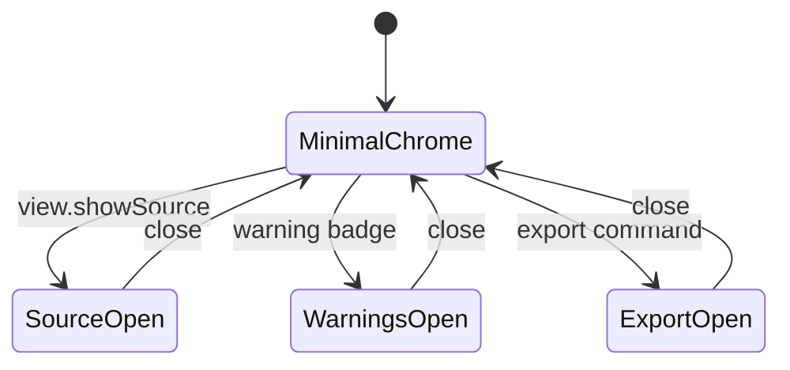

<!-- markdownlint-disable-next-line MD025 -->
# G12-001 - Contextual Panels And Panel Host

## Linked Issue

- [G12-001 - Contextual Panels And Panel Host](https://github.com/flyingrobots/tadpole/issues/34)

## Roadmap Gate

- Goal 12: Contextual Panels And Panel Host

## Cycle Start

- [x] `git fetch origin` completed.
- [x] Local merge target branch synced to
  `origin/cycles/UIUX_editor-shell-design`.
- [x] Cycle branch checked out.
- [x] GitHub issue created.
- [x] `work-in-progress` label applied when implementation starts.
- [x] Design doc, issue link, and initial cycle scaffold staged and committed.
- [x] Branch pushed and non-draft PR opened to the merge target.

## Decision Summary

Goal 12 introduces a panel host that keeps Source, Warnings, Export, Layers,
Inspector, Workspace, Targets, Palette, Fonts, and Debug reachable but hidden by
default. Important state remains visible through compact status badges.

## Sponsored Human

A user wants source, warnings, export, and inspection tools available on demand
so that the SVG stage stays central while advanced tasks remain reachable.

## Sponsored Agent

An agent needs stable panel state and warning-count facts so it can verify
hidden secondary surfaces without relying on visual guesses.

## Hill

By the end of this cycle, a user can open and close contextual panels through
View/menu state, and the repo proves default hidden state, warning badges, and
panel focus behavior with a browser witness.

## Current Truth

- Current secondary surfaces compete for first-screen space.
- Parent design: [Context Panels](../design.md#context-panels).
- Mockup: [Panels](../mockups/panels-inspector-layers.svg).

## Problem

The editor cannot feel canvas-first while raw source, export payloads, palette
controls, warnings, and debug facts occupy permanent layout space.

## Scope

This cycle includes:

- Runtime panel host state.
- Source, Warnings, Export, and debug surfaces behind panels.
- Warning and dirty badges when panels are closed.
- Responsive dock/sheet behavior.
- Focus return to invoking controls.

## Non-Goals

This cycle does not include:

- Full Layers panel hierarchy.
- Full Inspector editing modes.
- SVG save serializer warnings.

## User Experience / Product Shape

Panels open as side docks on wide screens and modal sheets on narrow screens.
The stage and timeline remain the default visual priority.



## Runtime / API Contract

Panel IDs:

- `source`
- `warnings`
- `export`
- `layers`
- `inspector`
- `workspace`
- `targets`
- `palette`
- `fonts`
- `debug`

Panel state exposes `data-tadpole-active-panel`,
`data-tadpole-open-panel-ids`, per-panel `data-tadpole-panel-open` facts,
warning counts, and dirty-state facts.

## Data / State / Schema Model

Panel state is runtime UI state. Warning facts derive from import,
serialization, and validation state. No persisted schema changes in this cycle.

## Security / Trust Boundary

Source panel continues to display sanitized or raw draft SVG according to
existing import boundaries. Warnings panel may show removed unsafe content but
must not render unsafe SVG as executable markup.

## Accessibility Posture

| Surface | Requirement |
| ------- | ----------- |
| Panel host | Labelled region or dialog depending on layout. |
| Badges | Counts exposed as text. |
| Close | Keyboard reachable and returns focus. |
| Hidden panels | Not focusable while closed. |

## Localization / Directionality Posture

Panel names and badge text are visible strings. Docking must support left-to-
right and right-to-left layouts without relying on "left panel" copy.

## Agent Inspectability

Agents inspect `data-tadpole-panel-id`, `data-tadpole-panel-open`, and warning
count facts.

## Linked Invariants

- Secondary panels must not obscure the primary editing path by default.
- Hidden visual state needs an inspectable text/fact equivalent.
- Browser witnesses prove visual editor workflows.

## Alternatives Considered

### Option A: Remove Secondary Surfaces Temporarily

Pros:

- Fastest default layout cleanup.

Cons:

- Loses important workflows and debugging.

### Option B: Move Surfaces Into Panel Host

Pros:

- Keeps workflows reachable.
- Creates reusable panel boundary for later features.

Cons:

- Requires focus and responsive behavior work.

## Decision

Choose Option B. Panels become contextual surfaces rather than permanent
first-viewport content.

## Implementation Slices

- [x] Slice 1: Add panel state and host.
- [x] Slice 2: Move Source into panel host.
- [x] Slice 3: Move Warnings into panel host with badge.
- [x] Slice 4: Move Export/debug surfaces into panels.
- [x] Slice 5: Add responsive and focus browser witness.

## Tests To Write First

- [x] Browser witness: default load hides Source/Warnings/Export panels.
- [x] Browser witness: warning badge opens Warnings panel.
- [x] Browser witness: closing panel returns focus.

## Proof Matrix

| Claim | Required proof |
| ----- | -------------- |
| Panels hidden by default | Browser visibility assertion |
| Warnings remain discoverable | Badge count assertion |
| Focus is deterministic | Browser keyboard assertion |

## Acceptance Criteria

- [x] Default shell remains canvas-first.
- [x] All moved workflows remain reachable.
- [x] Warning state remains visible.
- [x] Closed panels are not focusable.
- [x] Local validation is green.

## Validation Plan

```bash
npm run check
npm run build
node docs/method/witness/editor-shell-production-ux/panel-host-smoke.mjs
```

## Playback / Witness

Run `panel-host-smoke.mjs` against wide and narrow viewports.

## Open Questions

- @flyingrobots: Which panel should auto-open after an import warning? Default
  to badge only unless the warning blocks work.

## Follow-On Issues

- [Goal 17 Layers panel](https://github.com/flyingrobots/tadpole/issues/39)
- [Goal 18 Inspector](https://github.com/flyingrobots/tadpole/issues/40)

## Retrospective

What changed from the design:

- Existing Goal 10/11 panel shells already carried most secondary surfaces. Goal
  12 hardened them into an inspectable panel host with active/open state facts,
  warning and dirty badges, deterministic close focus, and narrow viewport sheet
  behavior.

What the tests proved:

- `panel-host-smoke.mjs` proves Source, Warnings, and Export detail panels are
  hidden by default, panel state is inspectable through ledger facts, warning
  imports stay discoverable through the badge, badge-triggered panels open, and
  close returns focus on wide and narrow viewports.

What remains open:

- Goal 17 still owns full Layers navigation.
- Goal 18 still owns the full Inspector editing surface.

PR:

- [Goal 12 PR](https://github.com/flyingrobots/tadpole/pull/44)
