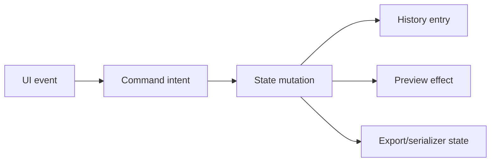

<!-- markdownlint-disable-next-line MD025 -->
# G16-001 - Editor Command Model And History

## Linked Issue

- [G16-001 - Editor Command Model And History](https://github.com/flyingrobots/tadpole/issues/38)

## Roadmap Gate

- Goal 16: Editor Command Model And History

## Cycle Start

- [x] `git fetch origin` completed.
- [x] Local merge target branch synced to `origin/main` by regular merge.
- [x] Cycle branch checked out.
- [x] GitHub issue created.
- [ ] `work-in-progress` label applied when implementation starts.
- [x] Design doc, issue link, and initial cycle scaffold staged and committed.
- [ ] Branch pushed and non-draft PR opened to the merge target.

## Decision Summary

Goal 16 routes editor mutations through typed command intents and reversible
history entries. The UI dispatches commands; command handlers mutate editor
state; effects render preview and serialization from state.

## Sponsored Human

A user wants undo and redo for destructive edits so that timeline authoring is
safe, without manually rebuilding tracks after a mistaken operation.

## Sponsored Agent

An agent needs pure command handlers and inspectable state transitions so it
can verify editor behavior without driving every path through pixels.

## Hill

By the end of this cycle, key timeline mutations dispatch through command IDs
and can be undone/redone through menu and keyboard paths, proven by focused
command tests and browser smoke coverage.

## Current Truth

- Much editor behavior currently lives directly in `frontend/src/App.svelte`.
- Existing issues track related debt: [#17](https://github.com/flyingrobots/tadpole/issues/17)
  and [#23](https://github.com/flyingrobots/tadpole/issues/23).
- Parent design: [Public Editor Commands](../design.md#public-editor-commands).

## Problem

As the production UX grows, direct UI state mutation will make undo/redo,
serialization, witnesses, and future scripting brittle.

## Scope

This cycle includes:

- Typed command intent definitions.
- Pure timeline mutation helpers.
- Dispatch path for selection, track, and keyframe edits.
- Undo/redo for core keyframe and track operations.
- Menu/keyboard bindings for undo/redo.

## Non-Goals

This cycle does not include:

- Full application decomposition.
- Multi-document history.
- Persistence serializer implementation.
- Collaborative editing.

## User Experience / Product Shape

Users invoke commands through menus, keyboard, timeline controls, or panels.
Undo and redo appear in Edit menu and keyboard shortcuts.



## Runtime / API Contract

Initial command types:

- `target.select`
- `track.add`
- `track.remove`
- `keyframe.set`
- `keyframe.move`
- `keyframe.delete`
- `timeline.seek`
- `edit.undo`
- `edit.redo`

Command handlers return next state plus optional history entry.

## Data / State / Schema Model

History stores reversible command deltas for runtime editor state. History is
not persisted into saved SVG in this goal.

## Security / Trust Boundary

Commands that introduce SVG-derived values must use existing validation helpers
before values enter state.

## Accessibility Posture

| Surface | Requirement |
| ------- | ----------- |
| Edit menu | Undo/redo disabled state exposed. |
| Keyboard | Cmd/Ctrl+Z and Shift redo paths. |
| Status | Undo/redo action result visible as text when useful. |
| Focus | Undo/redo must not lose selected row/keyframe unexpectedly. |

## Localization / Directionality Posture

Menu labels and status messages are visible strings. Command IDs are stable and
not localized.

## Agent Inspectability

Tests inspect command input, state output, history stack depth, selected IDs,
and browser command IDs.

## Linked Invariants

- Commands change state; effects do not.
- Runtime behavior is the proof.
- Timeline state must remain deterministic.

## Alternatives Considered

### Option A: Add Undo Directly Around UI Handlers

Pros:

- Smaller first patch.

Cons:

- Preserves brittle mutation paths.

### Option B: Introduce Command Boundary

Pros:

- Enables undo, testing, scripting, and serialization clarity.

Cons:

- Requires careful incremental extraction.

## Decision

Choose Option B. Command boundaries are the correct foundation for production
editing.

## Implementation Slices

- [ ] Slice 1: Extract pure timeline mutation helpers.
- [ ] Slice 2: Add command intent types and dispatcher.
- [ ] Slice 3: Route keyframe set/move/delete through commands.
- [ ] Slice 4: Add reversible history stack and undo/redo commands.
- [ ] Slice 5: Add focused tests and browser smoke.

## Tests To Write First

- [ ] Focused command test: set/move/delete keyframe changes state.
- [ ] Focused command test: undo/redo restores previous state.
- [ ] Browser witness: Edit > Undo reverses keyframe edit.

## Proof Matrix

| Claim | Required proof |
| ----- | -------------- |
| Commands mutate state | Focused command tests |
| Undo/redo is reliable | State and browser tests |
| UI dispatch is inspectable | Command-id assertions |

## Acceptance Criteria

- [ ] Core timeline edits dispatch through commands.
- [ ] Undo/redo covers keyframe and track operations.
- [ ] Existing import/preview behavior remains green.
- [ ] Command tests do not require pixel scraping.
- [ ] Local validation is green.

## Validation Plan

```bash
npm run check
npm run build
```

## Playback / Witness

Focused command tests plus a browser undo/redo flow after UI wiring.

## Open Questions

- @flyingrobots: Should import/revert be undoable in this goal or a follow-on?
  Keep import/revert follow-on unless slices finish early.

## Follow-On Issues

- [#17 Decompose the Svelte editor monolith](https://github.com/flyingrobots/tadpole/issues/17)
- [#23 Add undo and redo](https://github.com/flyingrobots/tadpole/issues/23)

## Retrospective

What changed from the design:

- TBD

What the tests proved:

- TBD

What remains open:

- TBD
