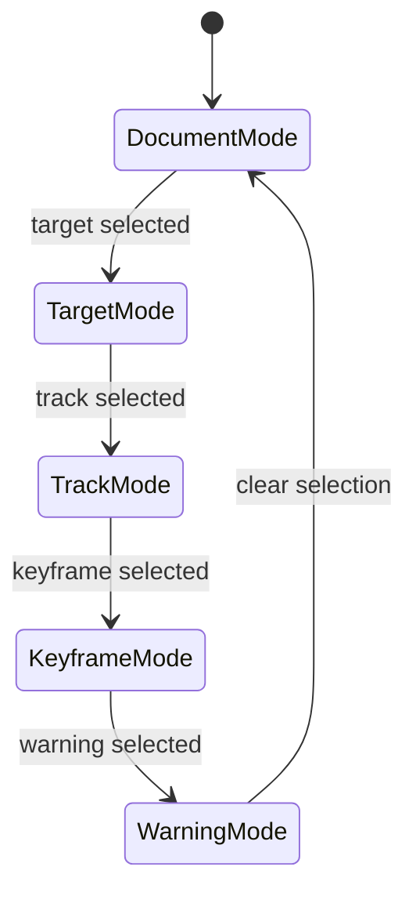

<!-- markdownlint-disable-next-line MD025 -->
# G18-001 - Inspector Editing Surface

## Linked Issue

- [G18-001 - Inspector Editing Surface](https://github.com/flyingrobots/tadpole/issues/40)

## Roadmap Gate

- Goal 18: Inspector Editing Surface

## Cycle Start

- [x] `git fetch origin` completed.
- [x] Local merge target branch synced to `origin/main` by regular merge.
- [x] Cycle branch checked out.
- [x] GitHub issue created or reused.
- [x] `work-in-progress` label applied when implementation starts.
- [x] Design doc, issue link, and initial cycle scaffold staged and committed.
- [ ] Branch pushed and non-draft PR opened to the merge target.

## Decision Summary

Goal 18 adds contextual Inspector modes for document, target, track, keyframe,
and warning selection. Inspector edits provide precision controls without
making common timeline timing edits depend on the Inspector.

## Sponsored Human

A user wants precise facts and controls for the selected thing so that they can
edit values confidently, without searching global controls.

## Sponsored Agent

An agent needs selected-state facts and inspector mode selectors so it can
verify contextual editing without guessing from panel text.

## Hill

By the end of this cycle, selecting a target, track, keyframe, or warning opens
the corresponding Inspector mode and keyframe edits update preview/export
state, proven by a browser witness.

## Current Truth

- Current `main` includes a thin drawer Inspector panel with selected target
  and track facts, but it does not expose a stable mode contract or keyframe
  editor. Evidence:
  [`frontend/src/App.svelte#5032:870f3c136e9a800c6ad12a4ad32ffbaa521eeef3`](https://github.com/flyingrobots/tadpole/blob/870f3c136e9a800c6ad12a4ad32ffbaa521eeef3/frontend/src/App.svelte#L5032).
- Current `main` also includes an always-visible timeline-side selection
  inspector with target, track, and keyframe controls, so precision editing
  exists but is not the contextual Inspector panel surface. Evidence:
  [`frontend/src/App.svelte#5754:870f3c136e9a800c6ad12a4ad32ffbaa521eeef3`](https://github.com/flyingrobots/tadpole/blob/870f3c136e9a800c6ad12a4ad32ffbaa521eeef3/frontend/src/App.svelte#L5754).
- Current timeline property rows still own direct keyframe editing, preserving
  the invariant that timing edits do not require the Inspector. Evidence:
  [`frontend/src/App.svelte#5677:870f3c136e9a800c6ad12a4ad32ffbaa521eeef3`](https://github.com/flyingrobots/tadpole/blob/870f3c136e9a800c6ad12a4ad32ffbaa521eeef3/frontend/src/App.svelte#L5677).
- Parent design: Inspector Model starts in
  [`docs/method/design/editor-shell-production-ux/design.md#1046:870f3c136e9a800c6ad12a4ad32ffbaa521eeef3`](https://github.com/flyingrobots/tadpole/blob/870f3c136e9a800c6ad12a4ad32ffbaa521eeef3/docs/method/design/editor-shell-production-ux/design.md#L1046).
- Mockup:
  [`docs/method/design/editor-shell-production-ux/mockups/panels-inspector-layers.svg`](../mockups/panels-inspector-layers.svg).

## Problem

Global controls do not scale as timeline and panel complexity grows. The editor
needs selection-driven precision controls with clear mode boundaries.

## Scope

This cycle includes:

- Inspector mode mapping from selection state.
- Document facts mode.
- Target facts and track creation actions.
- Track facts and defaults.
- Keyframe time/value/easing/source controls.
- Warning facts mode.

## Non-Goals

This cycle does not include:

- Curve tangent editing.
- Layer hierarchy editing.
- Serializer warning repair workflows.

## User Experience / Product Shape

Inspector opens contextually when useful. It can be closed; common timing edits
still happen directly in the timeline.



## Runtime / API Contract

Inspector modes:

- `document`
- `target`
- `track`
- `keyframe`
- `warning`

Each mode exposes selected IDs and validation state through stable selectors.

## Data / State / Schema Model

Inspector derives from selection and timeline state. Edits dispatch existing or
future command handlers. Invalid values do not enter timeline state.

## Security / Trust Boundary

Inspector text derived from SVG attributes is escaped. Value edits use existing
property validation before preview or export state updates.

## Accessibility Posture

| Surface | Requirement |
| ------- | ----------- |
| Inspector | Labelled complementary panel. |
| Mode | Heading names selected object. |
| Inputs | Labels include property/time/value. |
| Errors | Validation errors are textual and associated with fields. |

## Localization / Directionality Posture

Inspector labels and validation strings are visible. Controls must tolerate
long translated labels.

## Agent Inspectability

Browser witnesses inspect mode, selected IDs, field values, validation errors,
and preview/export updates.

## Linked Invariants

- Timeline edits must remain deterministic.
- Invalid keyframe values cannot enter project state.
- Browser witnesses prove user-visible editor workflows.

## Alternatives Considered

### Option A: Keep All Controls Inline

Pros:

- Fewer panels.

Cons:

- Timeline rows become too dense.

### Option B: Contextual Inspector

Pros:

- Keeps timeline focused on timing.
- Provides precise editing when needed.

Cons:

- Requires mode and focus management.

## Decision

Choose Option B. Inspector is contextual precision UI, not mandatory timing UI.

## Implementation Slices

- [ ] Slice 1: Add inspector mode derivation.
- [ ] Slice 2: Render document and target modes.
- [ ] Slice 3: Render track mode and track actions.
- [ ] Slice 4: Render keyframe editor with validation.
- [ ] Slice 5: Add warning mode and browser witness.

## Tests To Write First

- [ ] Browser witness: selecting a target opens target mode.
- [ ] Browser witness: selecting keyframe opens keyframe mode.
- [ ] Browser witness: keyframe value edit updates preview/export state.

## Proof Matrix

| Claim | Required proof |
| ----- | -------------- |
| Inspector follows selection | Browser mode assertions |
| Keyframe edits are valid | Browser preview/export assertion |
| Invalid values are blocked | Validation assertion |

## Acceptance Criteria

- [ ] Inspector modes match selection state.
- [ ] Keyframe edits update timeline and preview.
- [ ] Invalid values are rejected or warned.
- [ ] Timeline remains usable with Inspector closed.
- [ ] Local validation is green.

## Validation Plan

```bash
npm run check
npm run build
node docs/method/witness/editor-shell-production-ux/inspector-smoke.mjs
```

## Playback / Witness

Run `inspector-smoke.mjs` after importing a fixture with multiple target types.

## Open Questions

- @flyingrobots: Should Inspector auto-open on target selection or only when
  enabled? Default to contextual open on desktop and a panel sheet on narrow
  screens.

## Follow-On Issues

- Curves mode value-shape editing.

## Retrospective

What changed from the design:

- TBD

What the tests proved:

- TBD

What remains open:

- TBD
