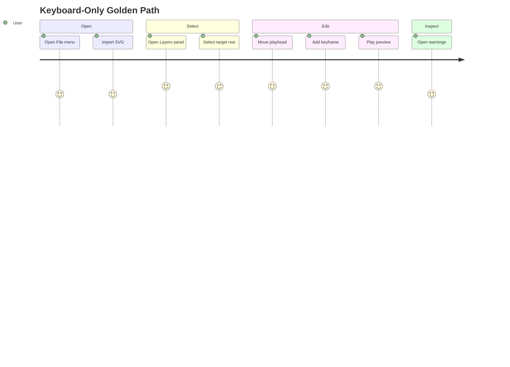

<!-- markdownlint-disable-next-line MD025 -->
# G19-001 - Keyboard Accessibility Witnesses

## Linked Issue

- [G19-001 - Keyboard Accessibility Witnesses](https://github.com/flyingrobots/tadpole/issues/41)

## Roadmap Gate

- Goal 19: Keyboard Accessibility Witnesses

## Cycle Start

- [x] `git fetch origin` completed.
- [x] Local merge target branch synced to `origin/main` by regular merge.
- [x] Cycle branch checked out.
- [x] GitHub issue created or reused.
- [x] `work-in-progress` label applied when implementation starts.
- [x] Design doc, issue link, and initial cycle scaffold staged and committed.
- [x] Branch pushed and non-draft PR opened to the merge target.

## Decision Summary

Goal 19 proves that the production editor is not pointer-only. Menus, dialogs,
Layers, timeline rows, keyframes, playhead movement, work area controls, and
warnings get keyboard paths and inspectable accessibility facts.

## Sponsored Human

A keyboard or screen-reader user wants to open an SVG, select a target, edit a
keyframe, preview motion, and inspect warnings without relying on pointer-only
canvas interactions.

## Sponsored Agent

An agent needs accessibility roles, names, focus paths, and keyboard witnesses
so it can verify lower-mode operation without scraping pixels.

## Hill

By the end of this cycle, a keyboard-only browser witness can complete the
golden path: open SVG, select target through Layers, add/edit a keyframe, play
preview, and open warnings.

## Current Truth

- Current `main` includes menu button and item keyboard handlers, so the top
  menu is already partly keyboard-operable. Evidence:
  [`frontend/src/App.svelte#4219:7e263e78c056c7a65a1b0078683d086e858c938e`](https://github.com/flyingrobots/tadpole/blob/7e263e78c056c7a65a1b0078683d086e858c938e/frontend/src/App.svelte#L4219).
- Current `main` includes global timeline keyboard shortcuts and shields menu
  and dialog text entry from shortcut handling. Evidence:
  [`frontend/src/App.svelte#1092:7e263e78c056c7a65a1b0078683d086e858c938e`](https://github.com/flyingrobots/tadpole/blob/7e263e78c056c7a65a1b0078683d086e858c938e/frontend/src/App.svelte#L1092).
- Current `main` makes layer rows keyboard focusable because they are buttons
  with stable layer facts, but there is no golden-path keyboard-only witness
  proving layer selection through edit and warning inspection. Evidence:
  [`frontend/src/App.svelte#5115:7e263e78c056c7a65a1b0078683d086e858c938e`](https://github.com/flyingrobots/tadpole/blob/7e263e78c056c7a65a1b0078683d086e858c938e/frontend/src/App.svelte#L5115).
- Current `main` exposes keyframe markers as buttons with keyboard handlers,
  but the focus path and shortcut outcomes are not covered by a dedicated
  accessibility witness. Evidence:
  [`frontend/src/App.svelte#5936:7e263e78c056c7a65a1b0078683d086e858c938e`](https://github.com/flyingrobots/tadpole/blob/7e263e78c056c7a65a1b0078683d086e858c938e/frontend/src/App.svelte#L5936).
- Parent design: [Accessibility Contract](../design.md#accessibility-contract)
  and [Keyboard Model](../design.md#keyboard-model).

## Problem

The production editor cannot be considered usable or agent-inspectable if core
workflow state exists only as visual layout or pointer affordances.

## Scope

This cycle includes:

- Semantic landmarks for shell, stage, panels, and timeline.
- Keyboard navigation for menus, timeline rows, keyframes, and panels.
- Keyboard alternatives for keyframe add/move/delete.
- Warning badge and panel accessibility checks.
- Browser keyboard-only golden path witness.

## Non-Goals

This cycle does not include:

- Full WCAG audit.
- Localization catalog extraction.
- Screen-reader snapshot tooling unless needed for proof.

## User Experience / Product Shape

Keyboard users can move through editor regions predictably. Focus never
disappears into hidden panels or canvas-only controls.



## Runtime / API Contract

Keyboard commands:

- Space: play/pause.
- Home/End: seek start/end.
- Left/Right: step one frame.
- Shift+Left/Right: step ten frames.
- K: add keyframe at playhead.
- Delete: delete selected keyframe or track.
- I/O: set work area in/out.
- L: toggle loop.
- Cmd/Ctrl+S: save SVG.
- Cmd/Ctrl+O: open SVG.

## Data / State / Schema Model

No persisted schema changes. Focus state and roving index are runtime UI state.

## Security / Trust Boundary

No new SVG import boundary. Keyboard-accessible source/warning panels must not
render unsafe SVG as executable content.

## Accessibility Posture

| Surface | Requirement |
| ------- | ----------- |
| Menubar | Keyboard menu expectations. |
| Canvas selection | Layers panel alternative. |
| Timeline rows | Keyboard navigable rows and keyframes. |
| Keyframes | Focusable controls with time/value labels. |
| Warnings | Badge count and textual list. |

## Localization / Directionality Posture

Keyboard shortcut labels and accessible names are visible strings. Directional
keys must remain logical under right-to-left layout.

## Agent Inspectability

Browser witnesses inspect roles, names, focused element, shortcut effects,
warning count, and timeline state facts.

## Linked Invariants

- Canvas interactions need non-pointer alternatives.
- Visual-only information needs a non-visual equivalent.
- Browser witnesses prove lower-mode behavior.

## Alternatives Considered

### Option A: Add Accessibility Opportunistically

Pros:

- Lower immediate scope.

Cons:

- Risks inaccessible architecture after UI hardens.

### Option B: Dedicated Keyboard Witness Goal

Pros:

- Forces cross-feature proof after major shell surfaces exist.
- Gives agents reliable lower-mode assertions.

Cons:

- Some fixes may touch multiple surfaces.

## Decision

Choose Option B. Accessibility proof is a goal, not a cleanup note.

## Implementation Slices

- [x] Slice 1: Add landmarks and accessible names.
- [x] Slice 2: Add timeline row/keyframe focus model.
- [x] Slice 3: Add keyboard keyframe add/move/delete commands.
- [x] Slice 4: Add menu/dialog/panel focus return checks.
- [x] Slice 5: Add keyboard-only golden path witness.

## Tests To Write First

- [x] Browser witness: keyboard-only import/select/edit/play path.
- [x] Browser witness: focus does not enter closed panels.
- [x] Browser witness: warning badge exposes count and opens list.

## Proof Matrix

| Claim | Required proof |
| ----- | -------------- |
| Core workflow is keyboard-operable | Keyboard-only browser witness |
| Visual state has text equivalent | Role/name assertions |
| Focus is deterministic | Focus order assertions |

## Acceptance Criteria

- [x] Keyboard-only golden path passes.
- [x] Focus order is deterministic.
- [x] Keyframe controls have accessible names.
- [x] Warning state has text equivalent.
- [x] Local validation is green.

## Validation Plan

```bash
npm run check
npm run build
npm audit --audit-level=moderate
node --check docs/method/witness/editor-shell-production-ux/keyboard-a11y-smoke.mjs
node docs/method/witness/editor-shell-production-ux/keyboard-a11y-smoke.mjs
node docs/method/witness/editor-shell-production-ux/menu-dialogs-smoke.mjs
node docs/method/witness/editor-shell-production-ux/panel-host-smoke.mjs
node docs/method/witness/editor-shell-production-ux/work-area-smoke.mjs
node docs/method/witness/editor-shell-production-ux/command-history-smoke.mjs
npx markdownlint-cli2 CHANGELOG.md BEARING.md docs/method/design/editor-shell-production-ux/features/keyboard-accessibility-witnesses.md
git diff --check
```

## Playback / Witness

Run `keyboard-a11y-smoke.mjs` against a fixture with at least one warning and
one editable target.

## Follow-On Issues

- Localization catalog strategy if visible strings continue to grow.

## Retrospective

What changed from the design:

- Menu item keyboard handling now explicitly activates the focused command on
  Enter or Space, rather than depending on browser-default button activation
  inside `role="menu"`.
- Timeline lanes and keyframe buttons now publish stable target/property/time/
  value facts and accessible names.
- Focused keyframe buttons now support keyboard move and delete actions.
- Playback work-area loop guards now require concrete numeric bounds before
  reading work-area start/end values.

What the tests proved:

- The browser witness proves a keyboard-driven import, Layers target
  selection, timeline lane keyframe creation, focused keyframe move/delete,
  Timeline menu playback, warning badge activation, warning list inspection,
  and panel close focus return.
- Regression witnesses prove the change does not break menu/dialog activation,
  panel host focus return, work-area playback, or command history shortcuts.

What remains open:

- A full WCAG audit and localization catalog extraction remain follow-on work.

PR:

- [#51](https://github.com/flyingrobots/tadpole/pull/51)
