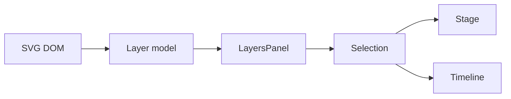

<!-- markdownlint-disable-next-line MD025 -->
# G17-001 - Layers Panel Navigation

## Linked Issue

- [G17-001 - Layers Panel Navigation](https://github.com/flyingrobots/tadpole/issues/39)

## Roadmap Gate

- Goal 17: Layers Panel Navigation

## Cycle Start

- [x] `git fetch origin` completed.
- [x] Local merge target branch synced to `origin/main` by regular merge.
- [x] Cycle branch checked out.
- [x] GitHub issue created.
- [ ] `work-in-progress` label applied when implementation starts.
- [x] Design doc, issue link, and initial cycle scaffold staged and committed.
- [ ] Branch pushed and non-draft PR opened to the merge target.

## Decision Summary

Goal 17 adds a Layers panel that exposes the SVG hierarchy, target IDs, labels,
kinds, track counts, warning counts, and keyboard selection path for complex
SVG documents.

## Sponsored Human

A user wants to select and inspect SVG targets from a structured layer list so
that small or overlapping canvas elements are still easy to animate.

## Sponsored Agent

An agent needs a machine-readable layer tree and synchronized selection facts so
it can verify target navigation without pointer-only interactions.

## Hill

By the end of this cycle, a user can open Layers, search SVG targets, select a
row, and see canvas/timeline selection synchronize, proven by a browser witness.

## Current Truth

- Tadpole discovers SVG targets and supports canvas selection.
- Existing issue [#22](https://github.com/flyingrobots/tadpole/issues/22)
  tracks layer tree navigation as a cool idea.
- Parent design: [Layers Panel Model](../design.md#layers-panel-model).

## Problem

Canvas-only target selection does not scale to dense SVGs and is not sufficient
as the non-pointer path for target selection.

## Scope

This cycle includes:

- SVG hierarchy view model.
- Layers panel rows with target facts.
- Selection sync between layer, canvas, and timeline.
- Search/filter by ID, name, and kind.
- Track/warning badges.

## Non-Goals

This cycle does not include:

- Reparenting SVG nodes.
- Editing SVG hierarchy.
- Multi-select targets.
- Saving layer visibility changes.

## User Experience / Product Shape

The Layers panel opens from View or contextual state. It lists SVG hierarchy,
supports search, and selects/focuses targets.



## Runtime / API Contract

Layer row facts:

- `targetId`
- `parentTargetId`
- `label`
- `kind`
- `depth`
- `trackCount`
- `warningCount`
- `selected`

## Data / State / Schema Model

Layer model derives from sanitized SVG DOM and current target registry. Search
query and expanded hierarchy state are runtime UI state.

## Security / Trust Boundary

Layer labels are text derived from SVG attributes and must be escaped. The
panel must not render raw SVG markup.

## Accessibility Posture

| Surface | Requirement |
| ------- | ----------- |
| Tree rows | Keyboard navigable tree/list semantics. |
| Search | Labelled input and result count. |
| Selection | Selected state exposed. |
| Badges | Track/warning counts exposed as text. |

## Localization / Directionality Posture

Search placeholder, empty states, and row badges are visible strings. Tree
indentation must support directionality.

## Agent Inspectability

Browser witnesses inspect row facts, selection state, search results, and
canvas/timeline sync.

## Linked Invariants

- Canvas target selection must have a non-pointer alternative.
- SVG-derived text is untrusted until escaped.
- Selection state must remain deterministic.

## Alternatives Considered

### Option A: Flat Target List

Pros:

- Simpler to build.

Cons:

- Loses SVG hierarchy context.

### Option B: Hierarchical Layers Panel

Pros:

- Matches production editor expectations.
- Supports complex documents.

Cons:

- Needs hierarchy view model.

## Decision

Choose Option B. Hierarchy is necessary for real SVG inspection.

## Implementation Slices

- [ ] Slice 1: Build SVG hierarchy model.
- [ ] Slice 2: Render Layers panel rows.
- [ ] Slice 3: Sync selection to stage and timeline.
- [ ] Slice 4: Add search/filter and badges.
- [ ] Slice 5: Add keyboard/browser witness.

## Tests To Write First

- [ ] Browser witness: layer row selection selects canvas target.
- [ ] Browser witness: search filters by ID/name/kind.
- [ ] Browser witness: warning/track counts are exposed.

## Proof Matrix

| Claim | Required proof |
| ----- | -------------- |
| Layer tree reflects SVG | Row fact assertions |
| Selection syncs | Browser selection assertion |
| Keyboard path works | Browser keyboard flow |

## Acceptance Criteria

- [ ] Layers panel shows SVG hierarchy.
- [ ] Layer selection syncs with stage and timeline.
- [ ] Search works by ID/name/kind.
- [ ] Keyboard navigation works.
- [ ] Local validation is green.

## Validation Plan

```bash
npm run check
npm run build
node docs/method/witness/editor-shell-production-ux/layers-panel-smoke.mjs
```

## Playback / Witness

Run `layers-panel-smoke.mjs` against a nested SVG fixture.

## Open Questions

- @flyingrobots: Should non-animated but selectable nodes show by default? Yes,
  with filters for animated-only later.

## Follow-On Issues

- [#22 Layer tree navigation](https://github.com/flyingrobots/tadpole/issues/22)
- [#25 Multi-select SVG targets](https://github.com/flyingrobots/tadpole/issues/25)

## Retrospective

What changed from the design:

- TBD

What the tests proved:

- TBD

What remains open:

- TBD
