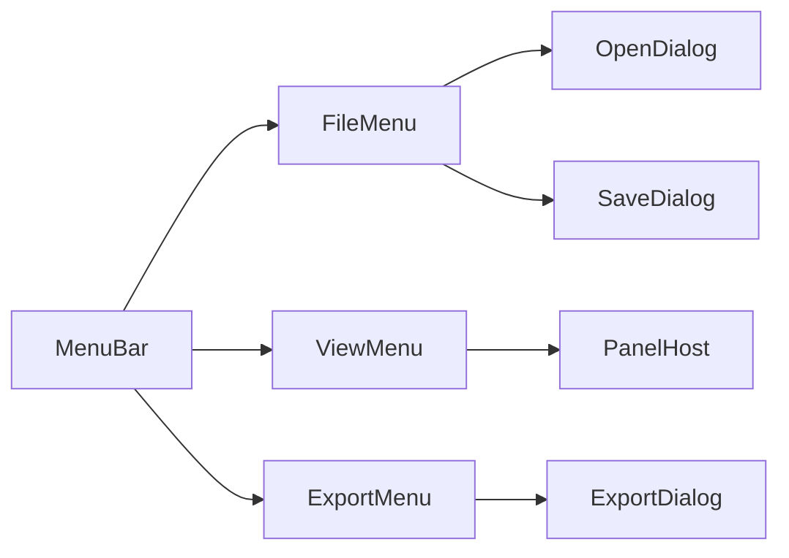

<!-- markdownlint-disable-next-line MD025 -->
# G11-001 - Menu Commands And Document Dialogs

## Linked Issue

- [G11-001 - Menu Commands And Document Dialogs](https://github.com/flyingrobots/tadpole/issues/33)

## Roadmap Gate

- Goal 11: Menu Commands And Document Dialogs

## Cycle Start

- [x] `git fetch origin` completed.
- [x] Local merge target branch synced to `origin/main` by regular merge.
- [x] Cycle branch checked out.
- [x] GitHub issue created.
- [x] `work-in-progress` label applied when implementation starts.
- [x] Design doc, issue link, and initial cycle scaffold staged and committed.
- [x] Branch pushed and non-draft PR opened to the merge target.

## Decision Summary

Goal 11 moves document and secondary workflows into explicit menus and dialogs
with stable command IDs. This lets the shell hide non-primary surfaces by
default without losing import, source, warning, export, and help workflows.

## Sponsored Human

A designer or engineer wants familiar File/Edit/View/Timeline/Export/Help menus
so that SVG document actions are discoverable without every panel being visible
at once.

## Sponsored Agent

An agent needs command IDs, dialog roles, and disabled-state facts so it can
exercise document workflows deterministically.

## Hill

By the end of this cycle, a user can open menus, launch Open/Paste/Save/Export
dialogs, and toggle secondary panels through commands, and the repo proves it
with a browser menu/dialog witness.

## Current Truth

- Current document actions are mostly direct buttons in always-visible panels.
- Parent design command lists live in [Editor Shell Production UX](../design.md).
- Mockups: [File menu](../mockups/menu-file-open.svg),
  [Import dialog](../mockups/import-svg-dialog.svg), and
  [Export dialog](../mockups/export-svg-dialog.svg).

## Problem

The production shell cannot hide secondary panels safely until their workflows
move behind inspectable commands and dialogs.

## Scope

This cycle includes:

- File, Edit, View, Timeline, Export, and Help menu shells.
- Command IDs for the menu actions named by the parent design.
- Open SVG, Paste SVG, Save SVG, and Export Runnable dialog shells.
- View toggles for source, warnings, layers, inspector, export, and debug
  surfaces.
- Browser witness for pointer and keyboard menu activation.

## Non-Goals

This cycle does not include:

- Full SVG-native save serializer.
- Complete undo/redo history.
- Timeline row rebuild.
- Full help/documentation content.

## User Experience / Product Shape

The menu bar remains at the top of the editor shell. Dialogs are modal and keep
the current stage/timeline context visible where possible.



## Runtime / API Contract

Initial command IDs:

- `file.openSvg`
- `file.pasteSvg`
- `file.saveSvg`
- `file.saveSvgAs`
- `file.revertSvg`
- `view.showSource`
- `view.showWarnings`
- `view.showLayers`
- `view.showInspector`
- `view.showExport`
- `view.showDebug`
- `timeline.playPause`
- `export.runnableHtml`

Each menu item exposes `data-tadpole-command="<id>"`.

## Data / State / Schema Model

Menu and dialog open state is runtime UI state. Dialog acceptance dispatches
existing import/export actions until later goals replace them with command
model dispatch.

## Security / Trust Boundary

Open/Paste SVG dialogs continue to feed the existing SVG import parser and
sanitizer. Dialog previews must never execute raw SVG script, style animation,
or external references.

## Accessibility Posture

| Surface | Requirement |
| ------- | ----------- |
| Menus | Keyboard open/close and arrow navigation. |
| Dialogs | Focus trap, labelled title, Escape close, return focus. |
| Commands | Disabled state exposed semantically. |
| Warnings | Counts are text-accessible. |

## Localization / Directionality Posture

Menu labels and dialog titles are user-visible strings. Keep labels short and
avoid directional icon-only affordances without text alternatives.

## Agent Inspectability

Agents inspect command IDs, dialog roles, dialog headings, and panel-open state
without scraping pixels.

## Linked Invariants

- Commands mutate editor state; effects do not.
- SVG import remains untrusted until sanitized.
- Browser witnesses prove rendered workflows.

## Alternatives Considered

### Option A: Keep Panel Buttons As Primary Commands

Pros:

- Less UI code movement.

Cons:

- Keeps the first viewport crowded.

### Option B: Add Menus Before Deep Refactor

Pros:

- Makes production workflow discoverable.
- Provides command IDs for later command-model extraction.

Cons:

- Some menu commands temporarily call existing handlers.

## Decision

Choose Option B. Menus become the stable user-facing command layer while deeper
state refactors land later.

## Implementation Slices

- [x] Slice 1: Add menubar and command-id menu items.
- [x] Slice 2: Move open/paste flows into File menu dialogs.
- [x] Slice 3: Move runnable export into Export dialog.
- [x] Slice 4: Add View menu panel toggles.
- [x] Slice 5: Add keyboard/pointer browser witness.

## Tests To Write First

- [x] Browser witness: File > Open SVG opens a dialog.
- [x] Browser witness: View > Source toggles Source panel.
- [x] Browser witness: Export > Runnable HTML opens export dialog.

## Proof Matrix

| Claim | Required proof |
| ----- | -------------- |
| Commands are inspectable | Command-id assertions |
| Dialogs preserve workflows | Browser import/export witness |
| Keyboard menu path works | Browser keyboard flow |

## Acceptance Criteria

- [x] Menus expose the command IDs in this doc.
- [x] Dialogs preserve current import/export behavior.
- [x] Dialog focus behavior is deterministic.
- [x] Secondary panels are command-accessible.
- [x] Local validation is green.

## Validation Plan

```bash
npm run check
npm run build
node docs/method/witness/editor-shell-production-ux/menu-dialogs-smoke.mjs
```

## Playback / Witness

Run the app and execute `menu-dialogs-smoke.mjs`.

## Open Questions

- @flyingrobots: Should Save SVG be enabled before the Goal 15 serializer
  lands? Use a disabled command with tooltip or a temporary Export route.

## Follow-On Issues

- [Goal 12 panels](https://github.com/flyingrobots/tadpole/issues/34)
- [Goal 15 SVG save](https://github.com/flyingrobots/tadpole/issues/37)

## Retrospective

What changed from the design:

- The File, Edit, View, Timeline, Export, and Help menus were implemented as a
  direct command shell over the existing Svelte handlers.
- Save SVG opens a dialog shell with the native SVG download action disabled
  until Goal 15 lands; it offers project JSON copy as the temporary route.
- View commands now expose source, warnings, layers, inspector, export, debug,
  target, palette, workspace, and font surfaces through the panel host.

What the tests proved:

- `menu-dialogs-smoke.mjs` proves command IDs, File keyboard activation,
  Open/Paste SVG dialogs, View command panel state, and Export Runnable dialog
  output.
- Existing editor-shell, import-gate, project-export, runnable-export,
  rough-UX, and animation-import witnesses still pass through the new menu
  command paths.

What remains open:

- Goal 12 should replace the lightweight panel shells with richer contextual
  panel behavior.
- Goal 15 should enable true SVG-native save serialization.
- Goal 16 should move the command shell behind a runtime-backed command/history
  model.
