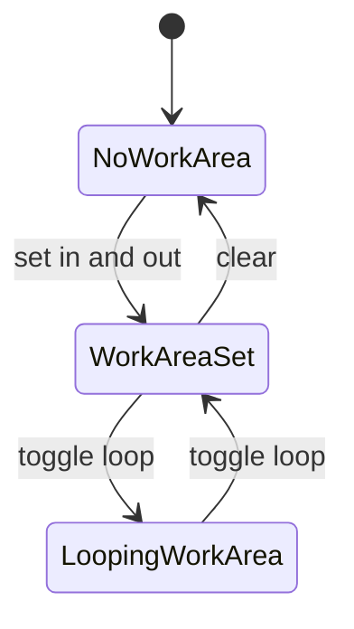

<!-- markdownlint-disable-next-line MD025 -->
# G14-001 - Playback Work Area Controls

## Linked Issue

- [G14-001 - Playback Work Area Controls](https://github.com/flyingrobots/tadpole/issues/36)

## Roadmap Gate

- Goal 14: Playback Work Area Controls

## Cycle Start

- [x] `git fetch origin` completed.
- [x] Local merge target branch synced to `origin/main` by regular merge.
- [x] Cycle branch checked out.
- [x] GitHub issue created.
- [ ] `work-in-progress` label applied when implementation starts.
- [x] Design doc, issue link, and initial cycle scaffold staged and committed.
- [ ] Branch pushed and non-draft PR opened to the merge target.

## Decision Summary

Goal 14 adds GSDevTools-style review controls to the bottom timeline: in/out
work area markers, loop work area, seconds/frames display, and keyboard
playback/seek commands.

## Sponsored Human

A user wants to isolate and loop a small section of an SVG animation so that
timing can be reviewed precisely without changing document duration.

## Sponsored Agent

An agent needs inspectable playback state, work area bounds, and command IDs so
it can verify time behavior deterministically.

## Hill

By the end of this cycle, a user can set in/out points, loop the work area,
toggle time units, and use keyboard playback commands, proven by a browser
work-area witness.

## Current Truth

- Current playback supports basic play, pause, scrub, and looping.
- Parent design: [Work Area](../design.md#work-area).
- Work area is not yet first-class editor state.

## Problem

Basic playback is not enough for production animation editing. Users need to
loop review ranges, step through frames, and switch time display without
changing the animation's real duration.

## Scope

This cycle includes:

- Work area state with in/out times.
- Ruler markers for in/out points.
- Loop behavior constrained to work area when present.
- Seconds/frames display toggle.
- Keyboard commands for play, seek, step, in/out, and loop.

## Non-Goals

This cycle does not include:

- Persisting work area metadata to SVG.
- Multi-timeline selection.
- Curves mode.

## User Experience / Product Shape

Work area markers sit on the bottom time ruler. The playback bar remains
visible even when timeline stacks collapse.



## Runtime / API Contract

Playback state adds:

- `workAreaInMs: number | null`
- `workAreaOutMs: number | null`
- `loopWorkArea: boolean`
- `timeDisplayMode: "seconds" | "frames"`

Command IDs:

- `timeline.setInPoint`
- `timeline.setOutPoint`
- `timeline.clearWorkArea`
- `timeline.toggleLoop`
- `timeline.toggleFramesSeconds`

## Data / State / Schema Model

Work area is runtime editor state in this goal. It may later serialize to
optional Tadpole metadata but is not animation truth.

## Security / Trust Boundary

No new untrusted input. Imported metadata is not read for work area in this
cycle.

## Accessibility Posture

| Surface | Requirement |
| ------- | ----------- |
| In/out markers | Keyboard set/clear and text time labels. |
| Loop toggle | Pressed state exposed. |
| Time display | Current unit exposed in text. |
| Playhead | Current time announced as text. |

## Localization / Directionality Posture

Time labels use numeric formatting already present in the app. Avoid layout
that assumes `I` and `O` labels have fixed width.

## Agent Inspectability

Browser witnesses inspect work area state attributes, current time, loop state,
and time-unit text.

## Linked Invariants

- In/out points define review range, not document duration.
- Timeline controls remain visible.
- Browser witnesses prove time behavior.

## Alternatives Considered

### Option A: Use Document Duration Only

Pros:

- Simpler state.

Cons:

- No focused review loop.

### Option B: Add Editor Work Area

Pros:

- Matches GSDevTools and animation-editor expectations.
- Does not mutate animation duration.

Cons:

- Adds runtime playback state.

## Decision

Choose Option B. Work area is essential review UX and remains runtime state for
this goal.

## Implementation Slices

- [ ] Slice 1: Add work area state and command handlers.
- [ ] Slice 2: Render in/out markers on the ruler.
- [ ] Slice 3: Constrain loop playback to work area.
- [ ] Slice 4: Add seconds/frames display toggle.
- [ ] Slice 5: Add keyboard and browser witness coverage.

## Tests To Write First

- [ ] Browser witness: set in/out points and assert loop clamps to range.
- [ ] Browser witness: seconds/frames toggle changes visible time units.
- [ ] Browser witness: keyboard shortcuts dispatch commands.

## Proof Matrix

| Claim | Required proof |
| ----- | -------------- |
| Work area loops | Browser playback assertion |
| Units toggle | Browser text assertion |
| Keyboard works | Browser keyboard flow |

## Acceptance Criteria

- [ ] In/out markers can be set, moved, and cleared.
- [ ] Loop respects work area.
- [ ] Time display toggles seconds/frames.
- [ ] Playback controls stay bottom-visible.
- [ ] Local validation is green.

## Validation Plan

```bash
npm run check
npm run build
node docs/method/witness/editor-shell-production-ux/work-area-smoke.mjs
```

## Playback / Witness

Run `work-area-smoke.mjs` with a deterministic two-second fixture.

## Open Questions

- @flyingrobots: Should work area markers snap to frames by default? Default to
  the current snap setting.

## Follow-On Issues

- Store work area as optional SVG metadata during or after Goal 15.

## Retrospective

What changed from the design:

- TBD

What the tests proved:

- TBD

What remains open:

- TBD
