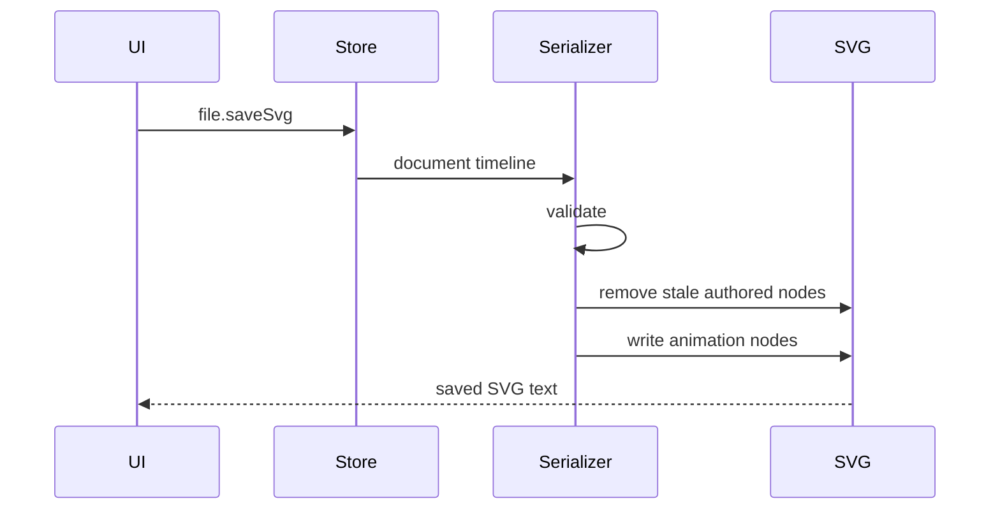

<!-- markdownlint-disable-next-line MD025 -->
# G15-001 - SVG Native Save Roundtrip

## Linked Issue

- [G15-001 - SVG Native Save Roundtrip](https://github.com/flyingrobots/tadpole/issues/37)

## Roadmap Gate

- Goal 15: SVG Native Save Roundtrip

## Cycle Start

- [x] `git fetch origin` completed.
- [x] Local merge target branch synced to `origin/cycles/UIUX_playback-work-area-controls`.
- [x] Cycle branch checked out.
- [x] GitHub issue created.
- [x] `work-in-progress` label applied when implementation starts.
- [x] Design doc, issue link, and initial cycle scaffold staged and committed.
- [x] Branch pushed and non-draft PR opened to the merge target.

## Decision Summary

Goal 15 makes the SVG file the durable source of truth: supported editable
tracks serialize back to standard SVG animation nodes, stale Tadpole-authored
nodes are replaced deterministically, and reopening the saved SVG reconstructs
the same editable timeline without a sidecar.

## Sponsored Human

A designer or engineer wants to save the same SVG file they opened so that the
animation artifact travels by itself, without project JSON or generated HTML as
required state.

## Sponsored Agent

An agent needs a deterministic parse/serialize contract and roundtrip witness
so it can verify SVG persistence without inspecting private runtime state.

## Hill

By the end of this cycle, a user can save editable tracks into one SVG file,
reopen that SVG, and recover matching target IDs, properties, keyframe times,
and values through the import surface.

## Current Truth

- Goal 9 imports a safe SMIL subset into editable tracks.
- Runnable HTML export exists as a derived review artifact.
- The production invariant says save must write one SVG file, not a sidecar.
- Parent design: [SVG-Native Persistence Contract](../design.md#svg-native-persistence-contract).

## Problem

Tadpole can import and edit SVG animation timelines, but persistence is not yet
SVG-native. Until save writes animation nodes back into SVG, the main product
contract is incomplete.

## Scope

This cycle includes:

- Serializer contract for supported properties.
- Stale Tadpole-authored animation node removal.
- Standard SVG animation node writing for supported properties.
- Optional metadata only for editor conveniences.
- Save/reopen browser witness.

## Non-Goals

This cycle does not include:

- Full SMIL parity.
- Curves mode.
- Optimized SVG cleanup UI.
- External files, CSS bundles, or JavaScript sidecars.

## User Experience / Product Shape

Save SVG is the primary persistence action. Export Runnable remains secondary.
Warnings block or require confirmation when tracks cannot serialize faithfully.



## Runtime / API Contract

Serializer API shape:

```ts
class SvgNativeSaveRequest {
  constructor(
    source: string,
    tracks: SvgNativeSaveTrack[],
    durationMs: number,
    isLooping: boolean,
  );
}

class SvgNativeSaveResult {
  readonly ok: boolean;
  readonly svgText: string;
  readonly warnings: SvgNativeSaveWarning[];
  readonly serializedTrackCount: number;
}
```

Supported output properties:

- `opacity`
- `fill`
- `stroke`
- `strokeWidth`
- `x`
- `y`
- `scale`
- `rotation`

## Data / State / Schema Model

Motion truth must exist in standard SVG animation nodes when supported. Optional
metadata may hold labels, track IDs, work area, grouping, and unsupported easing
names, but not the only copy of keyframe times or values.

## Security / Trust Boundary

Saved SVG must preserve the sanitizer trust boundary:

- Do not reintroduce script/style execution.
- Preserve safe non-animation content.
- Reject unsafe URL/style values.
- Escape metadata text.

## Accessibility Posture

| Surface | Requirement |
| ------- | ----------- |
| Save dialog | Warning summary is textual. |
| Blocked save | Focus moves to actionable warning. |
| Successful save | Status message is exposed. |
| Reopen proof | Roundtrip witness inspects runtime facts. |

## Localization / Directionality Posture

Save, warning, and confirmation strings are visible. Keep strings short and
avoid direction-specific file-action copy.

## Agent Inspectability

Agents inspect saved SVG text, parsed track facts, warning codes, and browser
witness assertions.

## Linked Invariants

- The saved document is one SVG file.
- Runtime truth wins.
- Imported SVG and project data are untrusted until validated.
- Browser witnesses prove product workflows.

## Alternatives Considered

### Option A: Store Motion Only In Metadata

Pros:

- Easier to serialize rich editor state.

Cons:

- Violates SVG-native source-of-truth invariant.

### Option B: Standard SVG Nodes Plus Optional Metadata

Pros:

- Preserves portable SVG animation.
- Allows editor conveniences without sidecars.

Cons:

- Requires strict unsupported-state warnings.

## Decision

Choose Option B. Standard SVG animation nodes are motion truth; metadata is
editor convenience only.

## Implementation Slices

- [x] Slice 1: Add serializer fixtures and result type.
- [x] Slice 2: Serialize scalar/color property tracks.
- [x] Slice 3: Serialize transform tracks with deterministic component policy.
- [x] Slice 4: Add Save SVG command/dialog integration.
- [x] Slice 5: Add save/reopen roundtrip browser witness.

## Tests To Write First

- [x] Browser witness: opacity/fill/stroke/stroke-width roundtrip.
- [x] Browser witness: transform tracks roundtrip or warn.
- [x] Browser witness: Save SVG then reopen yields matching tracks.

## Proof Matrix

| Claim | Required proof |
| ----- | -------------- |
| SVG is persisted source of truth | Roundtrip witness |
| Unsupported states do not silently save | Serializer warning tests |
| Sanitizer boundary holds | Unsafe fixture regression |

## Acceptance Criteria

- [x] Save emits one SVG text/blob.
- [x] Reopen reconstructs matching editable tracks.
- [x] Unsupported states warn or block deterministically.
- [x] Runnable HTML remains a derived artifact.
- [x] Local validation is green.

## Validation Plan

```bash
npm run check
npm run build
node --check docs/method/witness/editor-shell-production-ux/svg-save-roundtrip-smoke.mjs
node docs/method/witness/editor-shell-production-ux/svg-save-roundtrip-smoke.mjs
```

## Playback / Witness

Run `svg-save-roundtrip-smoke.mjs` with an imported animated fixture. The
witness proves default unsupported sample tracks block save, a supported
animated SVG emits one SVG root with standard animation nodes, reopening that
SVG reconstructs matching editable tracks, and a second save does not duplicate
Tadpole-authored animation nodes.

## Open Questions

- Transform policy: aligned `x`/`y` tracks serialize into one `translate`
  `animateTransform`; `scale` and `rotation` serialize as separate
  `animateTransform` nodes. Unaligned `x`/`y` tracks block native save instead
  of silently changing keyframe timing.

## Follow-On Issues

- [#21 Export animated SVG markup without an HTML runtime shell](https://github.com/flyingrobots/tadpole/issues/21)
- [#30 Add full SVG animation import support matrix](https://github.com/flyingrobots/tadpole/issues/30)

## Retrospective

What changed from the design:

- The serializer landed as a runtime-backed frontend module with
  `SvgNativeSaveRequest`, `SvgNativeSaveResult`, and `SvgNativeSaveWarning`
  classes. Unsupported states block Save SVG when the normal importer cannot
  recover the result faithfully.

What the tests proved:

- The browser witness proves unsupported tracks block save, supported scalar
  and transform tracks serialize into one SVG text, reopened saved SVG rebuilds
  matching target/property/time/value tracks, and repeated saves do not
  duplicate Tadpole-authored nodes.

What remains open:

- Non-linear easing, partial-duration tracks, unaligned transform component
  keyframes, and broader SMIL parity remain deferred.

PR:

- <https://github.com/flyingrobots/tadpole/pull/47>
