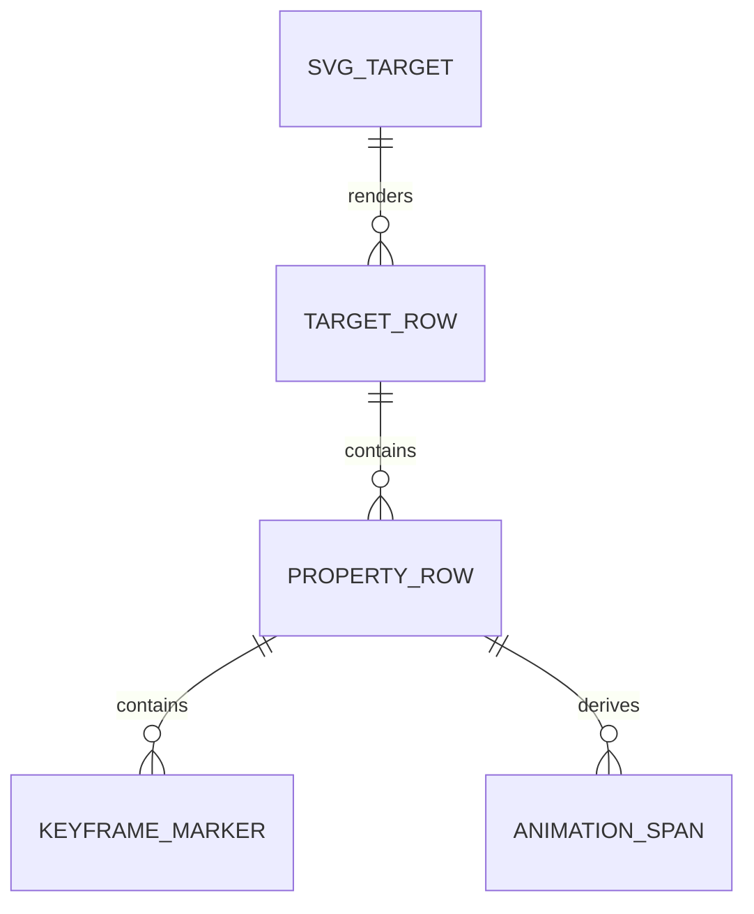

<!-- markdownlint-disable-next-line MD025 -->
# G13-001 - Target Property Timeline Stacks

## Linked Issue

- [G13-001 - Target Property Timeline Stacks](https://github.com/flyingrobots/tadpole/issues/35)

## Roadmap Gate

- Goal 13: Target Property Timeline Stacks

## Cycle Start

- [x] `git fetch origin` completed.
- [x] Local merge target branch synced to `origin/cycles/UIUX_contextual-panel-host`.
- [x] Cycle branch checked out.
- [x] GitHub issue created.
- [x] `work-in-progress` label applied when implementation starts.
- [x] Design doc, issue link, and initial cycle scaffold staged and committed.
- [ ] Branch pushed and non-draft PR opened to the merge target.

## Decision Summary

Goal 13 replaces flat track presentation with a dopesheet-style target/property
timeline stack: target rows group SVG elements, property rows own keyframes and
spans, and collapsed target rows keep summary key dots visible.

## Sponsored Human

A user editing a complex SVG wants to see animation organized by SVG target and
property so that timing edits stay scannable without hunting through unrelated
tracks.

## Sponsored Agent

An agent needs row-level target/property facts and keyframe marker data so it
can verify timeline organization without scraping rendered pixels.

## Hill

By the end of this cycle, imported and authored tracks appear as expandable
target rows with property tracks, keyframe markers, spans, and collapsed
summaries, proven by a browser timeline-stack witness.

## Current Truth

- Tracks have target IDs and properties in `frontend/src/App.svelte`.
- Goal 9 imports animation as editable tracks.
- Current track cards are not yet a production dopesheet.
- Parent design: [Timeline UX](../design.md#timeline-ux).
- Mockup: [Collapsed timeline stack](../mockups/timeline-collapsed.svg).

## Problem

Flat or card-like track editing does not scale to real SVGs with many animated
targets. Users need layer-like grouping and property rows aligned with time.

## Scope

This cycle includes:

- Target row view model derived from tracks and SVG targets.
- Property row rendering under expanded targets.
- Keyframe marker and animation span rendering.
- Collapse/expand target rows with summary dots.
- Browser witness for imported animation stack behavior.

## Non-Goals

This cycle does not include:

- Curves mode.
- Multi-select keyframe editing.
- SVG-native save serialization.
- Layer tree panel navigation.

## User Experience / Product Shape

Target rows show SVG ID, friendly label, kind, track count, key count, and
warning count. Expanded target rows show property tracks with keyframe markers
and spans. Collapsed rows keep summary key dots.



## Runtime / API Contract

View model facts:

- `targetId`
- `targetLabel`
- `targetKind`
- `expanded`
- `trackCount`
- `keyCount`
- `warningCount`
- `property`
- `keyframes`
- `spans`

Rows expose stable `data-tadpole-target-row` and
`data-tadpole-property-row` selectors.

## Data / State / Schema Model

Row data derives from existing timeline tracks and SVG targets. Expanded state
is runtime UI state until optional metadata is introduced.

## Security / Trust Boundary

No new import trust boundary. Target labels rendered in rows must be escaped
text, never raw SVG/HTML.

## Accessibility Posture

| Surface | Requirement |
| ------- | ----------- |
| Target row | Button/treeitem with expanded state. |
| Property row | Labelled row with property and current value. |
| Keyframe marker | Focusable control with time/value text. |
| Summary dots | Count text alternative. |

## Localization / Directionality Posture

Property names and row labels are visible strings. Timeline geometry must not
depend on English label length.

## Agent Inspectability

Browser witnesses inspect row data attributes, keyframe times, marker counts,
and collapsed summary facts.

## Linked Invariants

- Timeline state must remain deterministic.
- Layout owns interaction geometry.
- Browser witness coverage is required for visual editor workflows.

## Alternatives Considered

### Option A: Keep Existing Track Cards

Pros:

- Less UI work.

Cons:

- Does not match production animation-editor UX.

### Option B: Dopesheet Target/Property Rows

Pros:

- Scales to real SVG documents.
- Matches After Effects and Unity patterns.

Cons:

- Requires new row view model and keyboard model.

## Decision

Choose Option B. Dopesheet rows are the core production timeline abstraction.

## Implementation Slices

- [x] Slice 1: Build target/property row view model.
- [x] Slice 2: Render target rows with counts and warnings.
- [x] Slice 3: Render property rows with keyframe markers.
- [x] Slice 4: Render animation spans between adjacent keyframes.
- [x] Slice 5: Add collapse/expand summary dots and witness.

## Tests To Write First

- [x] Browser witness: imported SMIL creates target row and child property rows.
- [x] Browser witness: collapsed target row keeps summary key dots.
- [x] Browser witness: keyframe add/edit still works on property rows.

## Proof Matrix

| Claim | Required proof |
| ----- | -------------- |
| Tracks group by target/property | Browser row assertions |
| Collapse preserves summary | Browser collapse assertion |
| Editing still works | Browser keyframe edit assertion |

## Acceptance Criteria

- [x] Target rows group property tracks.
- [x] Keyframe markers and spans align to timeline ruler.
- [x] Collapsed rows show summary key facts.
- [x] Existing timeline edits still pass.
- [x] Local validation is green.

## Validation Plan

```bash
npm run check
npm run build
node docs/method/witness/editor-shell-production-ux/timeline-stacks-smoke.mjs
```

## Playback / Witness

Run `timeline-stacks-smoke.mjs` against the local app. The witness imports an
animated SVG fixture, asserts target/property row facts, collapses a target row
into summary dots, expands it, and edits a nested property-row keyframe.

## Open Questions

- Dense documents currently show all collapsed summary dots. Sampling remains a
  follow-on option if real SVGs make collapsed rows noisy.

## Follow-On Issues

- Curves mode after dopesheet stacks land.

## Retrospective

What changed from the design:

- The implementation keeps existing track-card editing controls inside
  property rows so older witnesses and direct keyframe edits continue to use the
  same runtime track objects.

What the tests proved:

- Imported SMIL tracks group under target rows, property rows expose keyframe
  markers and animation spans, collapsed target rows keep summary key dots, and
  edited property-row keyframes persist into project export.

What remains open:

- Curves mode, dense summary-dot sampling, multi-select keyframe editing, and
  SVG-native save serialization remain follow-on work.
