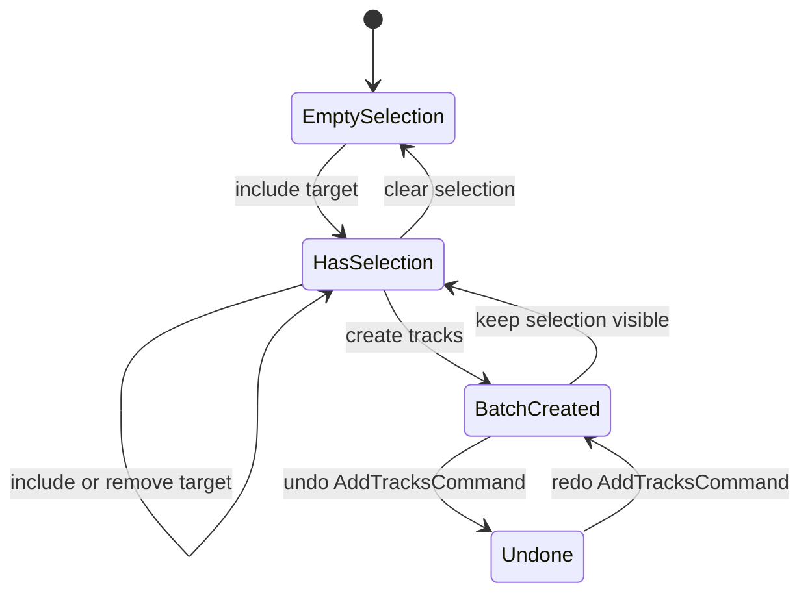
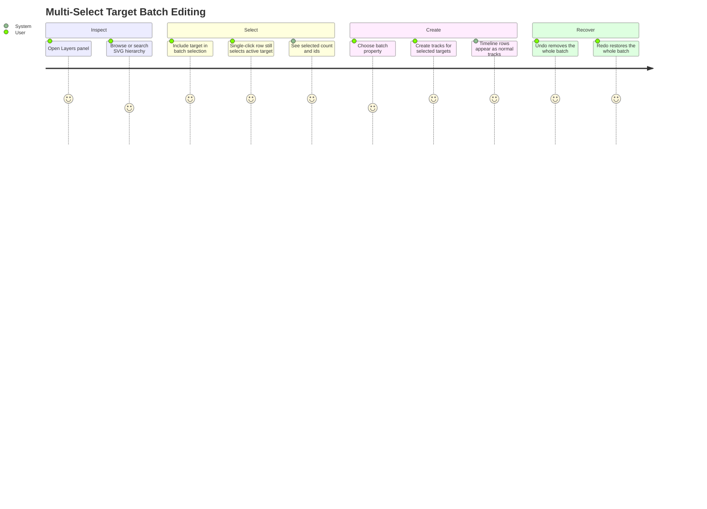
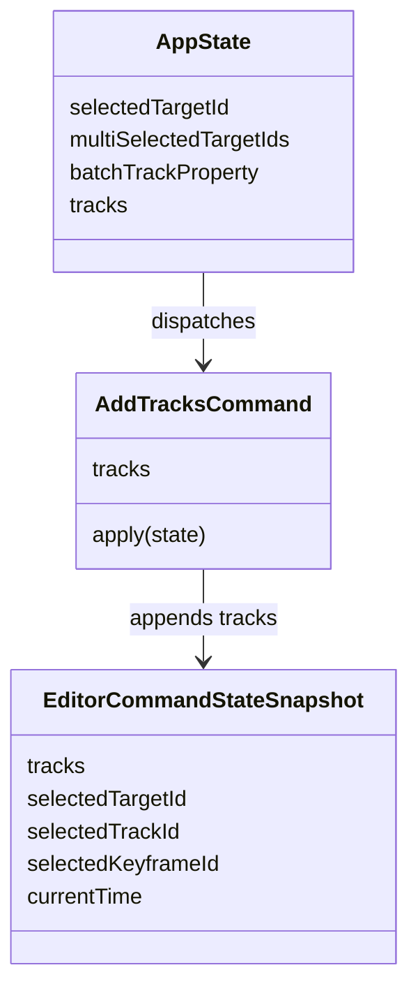

<!-- markdownlint-disable-next-line MD025 -->
# G22-001 - Multi-Select Target Batch Editing

## Linked Issue

- [#25 - COOL IDEA - Multi-select SVG targets for batch editing](https://github.com/flyingrobots/tadpole/issues/25)

## Decision Summary

Tadpole will add a visible, keyboard-accessible multi-select mode to the
Layers panel and a batch track creation command that creates matching timeline
tracks for every selected SVG target in one undoable editor action.

## Sponsored Human

A designer wants to choose several related SVG parts and create matching
animation tracks in one deliberate operation so that they can rough in motion
across a logo or illustration quickly, without repeating the same target and
property setup for each layer.

## Sponsored Agent

An agent needs inspectable multi-selection facts and a single batch command
contract so it can verify target selection and undo semantics, without scraping
visual highlights or inferring grouped intent from nearby SVG elements.

## Hill

By the end of this cycle, a user can multi-select SVG targets from the Layers
panel, create one track per selected target for a chosen property, undo and
redo that batch as one command, and the repo proves the workflow with a browser
witness that inspects UI facts and exported project JSON.

## Current Truth

- Layers rows already expose target id, parent id, label, kind, depth, track
  count, key count, warning count, and single-selection state. Evidence:
  [frontend/src/App.svelte#L5437:2b344315a4cf99d8b1d603274728fbfd3feb33e4](https://github.com/flyingrobots/tadpole/blob/2b344315a4cf99d8b1d603274728fbfd3feb33e4/frontend/src/App.svelte#L5437).
- Single target selection is owned by `selectTarget` and `selectLayerTarget`,
  which preserve the current target and optionally synchronize the active
  track. Evidence:
  [frontend/src/App.svelte#L4014:2b344315a4cf99d8b1d603274728fbfd3feb33e4](https://github.com/flyingrobots/tadpole/blob/2b344315a4cf99d8b1d603274728fbfd3feb33e4/frontend/src/App.svelte#L4014).
- Track creation currently creates one `TimelineTrack` and records one
  `AddTrackCommand`. Evidence:
  [frontend/src/App.svelte#L4054:2b344315a4cf99d8b1d603274728fbfd3feb33e4](https://github.com/flyingrobots/tadpole/blob/2b344315a4cf99d8b1d603274728fbfd3feb33e4/frontend/src/App.svelte#L4054).
- Command history already records undoable command snapshots and skips
  unchanged commands. Evidence:
  [frontend/src/EditorCommands.ts#L367:2b344315a4cf99d8b1d603274728fbfd3feb33e4](https://github.com/flyingrobots/tadpole/blob/2b344315a4cf99d8b1d603274728fbfd3feb33e4/frontend/src/EditorCommands.ts#L367).
- The command-history witness proves track add/remove undo and redo paths for
  single-track actions. Evidence:
  [docs/method/witness/editor-shell-production-ux/command-history-smoke.mjs#L125:2b344315a4cf99d8b1d603274728fbfd3feb33e4](https://github.com/flyingrobots/tadpole/blob/2b344315a4cf99d8b1d603274728fbfd3feb33e4/docs/method/witness/editor-shell-production-ux/command-history-smoke.mjs#L125).

## Problem

The editor can select one SVG target and create one track at a time, but SVG
animation work often starts by applying the same property track to several
related targets. Repeating the single-target path is slow, produces unnecessary
history noise, and gives agents no stable way to distinguish deliberate grouped
selection from incidental target adjacency.

## Scope

This cycle includes:

- Multi-selection state for SVG targets in the Layers panel.
- Add/remove/clear controls that do not replace existing single-target
  selection.
- A batch property picker for the initial track property.
- A batch create command that creates one validated track per selected target.
- One undo/redo history entry for the batch.
- Stable facts for selected ids, count, row selected state, and command result.
- Browser witness coverage for multi-select, batch create, undo, redo, and
  export JSON.

## Non-Goals

This cycle does not include:

- Canvas marquee selection.
- Drag reordering or group transforms.
- Batch keyframe editing beyond initial track creation.
- Multi-select persistence in saved project JSON.
- A full command palette.
- Automatic grouping based on SVG hierarchy.

## Runtime / API Contract

The batch-editing contract adds:

- `AddTracksCommand`: an editor command that accepts an immutable list of
  validated track snapshots and appends all tracks in one history entry.
- `multiSelectedTargetIds`: runtime UI state scoped to the current imported SVG.
- `batchTrackProperty`: the property used when creating new tracks for the
  selected target set.
- `createTracksForSelectedTargets`: a UI action that filters selected targets
  through current target reconciliation and track construction before dispatch.

State transitions:



`AddTracksCommand` must not accept raw UI state. It receives concrete track
snapshots that were already created by the same track factory used for
single-track creation.

## User Experience / Product Shape



The Layers panel gets a compact batch toolbar above the tree:

```text
+--------------------------------------------------+
| Layers                                           |
| [Search layers                                  ]|
| 4 visible  12 total  Selected #uiMain            |
| Batch: 3 selected   Property [Opacity v]         |
| [Create tracks for selected targets] [Clear]     |
+--------------------------------------------------+
| [x] ▸ Logo Group        #logoGroup   group 0 keys |
| [x]   Main Shape        #uiMain      shape 0 keys |
| [ ]   Accent Dot        #accentDot   shape 0 keys |
+--------------------------------------------------+
```

Each layer row has a sibling checkbox before the existing tree-item button.
The checkbox controls batch inclusion. The row button keeps its existing
single-selection behavior.

## Lower Modes

The batch surface exposes lower-mode facts:

- `data-tadpole-multi-select-count`
- `data-tadpole-multi-selected-target-ids`
- `data-tadpole-layer-multi-selected`
- `data-tadpole-layer-batch-toggle`
- `data-tadpole-batch-track-property`
- `data-tadpole-batch-create-tracks`
- `data-tadpole-batch-created-count`

These facts let tests and agents verify the mode without pixel scraping.

## Data / State Model



| State | Source of truth |
| ----- | --------------- |
| Single selected target | Existing `selectedTargetId` |
| Batch selected targets | Filtered `multiSelectedTargetIds` |
| Batch property | `batchTrackProperty` |
| Track snapshots | Existing track factory and validation path |
| Undo/redo | `EditorCommandHistory` entry with command id `track.addMany` |

Reset behavior:

- Importing a new SVG filters multi-selection to targets still present.
- Selecting a row does not clear multi-selection.
- Clearing batch selection does not clear single selection.
- Undo and redo restore tracks, not multi-selection UI state.

## Accessibility Posture

| Surface | Requirement |
| ------- | ----------- |
| Batch toolbar | Names selected count and property control. |
| Batch checkboxes | Each checkbox names the target label and selected state. |
| Existing row button | Keeps treeitem and single-select keyboard behavior. |
| Batch create button | Disabled with zero selected targets. |
| Status | Count changes are announced in the Layers panel live region. |

## Localization Posture

New visible strings are local English app copy. Tadpole does not yet have a
string catalog; no locale files are changed in this cycle.

## Agent Inspectability

An agent can inspect:

- The Layers panel count and selected ids from panel-level attributes.
- Per-row batch inclusion from row-level attributes.
- The chosen batch property from the property select.
- The command-history last command id after batch creation.
- Project export JSON for one track per selected target.

## Linked Invariants

- Runtime truth wins.
- Single-target workflows continue to work.
- Batch editing dispatches one command for one user operation.
- One SVG remains the saved document.
- Tests exercise rendered UI and export state.
- Design docs do not prove implementation.

## Design Alternatives Considered

### Option A: Shift-click rows only

Pros:

- Familiar desktop gesture.
- Minimal visible chrome.

Cons:

- Hidden affordance.
- Harder to witness reliably.
- Weak screen-reader discoverability.

### Option B: Explicit checkboxes plus batch toolbar

Pros:

- Clear and keyboard-accessible.
- Easy to witness through stable facts.
- Preserves current row button behavior.

Cons:

- Adds visible controls to the Layers panel.

## Decision

Choose Option B. Explicit batch checkboxes keep the interaction obvious while
preserving the existing single-select row interaction.

## Implementation Slices

- [x] Slice 1: Add Goal 22 design doc and mark issue #25 in progress.
- [x] Slice 2: Add failing browser witness for multi-select batch creation and
      one-step undo/redo.
- [x] Slice 3: Add `AddTracksCommand` and refactor track construction so
      single and batch creation share the same track factory.
- [x] Slice 4: Wire Layers panel multi-select controls and inspectable facts.
- [x] Slice 5: Validate, document, push, open PR, and close the cycle.

## Tests To Write First

- [x] Browser witness imports a multi-target static SVG and opens Layers.
- [x] Browser witness toggles multiple target checkboxes and verifies count,
      ids, and row facts.
- [x] Browser witness creates batch tracks and verifies exported project JSON.
- [x] Browser witness undoes the batch in one step and redoes it in one step.

## Acceptance Criteria

- [x] Users can add and remove targets from a multi-selection without losing
      current single-target workflows.
- [x] Batch track creation uses existing track validation and target
      reconciliation paths.
- [x] Multi-selected state is visible, keyboard-accessible, and inspectable.
- [x] Batch operations interact cleanly with undo/redo once command history
      exists.
- [x] Browser witness proves the workflow through rendered UI and exported
      project state.

## Validation Plan

```bash
npm run check
npm run build
TADPOLE_APP_URL=http://localhost:5173/ \
  node docs/method/witness/svg-timeline-mvp/multi-select-batch-smoke.mjs
TADPOLE_APP_URL=http://localhost:5173/ \
  node docs/method/witness/editor-shell-production-ux/layers-panel-smoke.mjs
TADPOLE_APP_URL=http://localhost:5173/ \
  node docs/method/witness/editor-shell-production-ux/command-history-smoke.mjs
npx markdownlint-cli2 \
  docs/method/design/svg-timeline-mvp/multi-select-target-batch-editing.md \
  CHANGELOG.md
git diff --check
```

## Playback / Witness

```bash
TADPOLE_APP_URL=http://localhost:5173/ \
  node docs/method/witness/svg-timeline-mvp/multi-select-batch-smoke.mjs
```

The witness imports a static SVG, opens Layers, batch-selects targets, creates
matching tracks, validates exported JSON, undoes the batch in one step, and
redoes it in one step.

## Risks

Known risks:

- The Layers panel could become visually crowded.
- Batch-created duplicate target/property tracks could surprise users.

Mitigations:

- Keep the toolbar compact and facts dense.
- Skip target/property pairs that already exist in the timeline.

## Follow-On Issues

- Canvas marquee selection.
- Batch mute, delete, and clear operations for existing tracks.
- Batch keyframe value editing.

## Retrospective

What changed from the design:

- The implementation stayed within the explicit checkbox and batch toolbar
  design. Batch creation skips target/property pairs that already exist.

What the tests proved:

- The browser witness imports a static SVG, checks three layer batch toggles,
  verifies selected ids and row facts, preserves independent single-target row
  selection, creates three opacity tracks with one `track.addMany` command, and
  proves undo/redo restores exported project JSON in one step.

What remains open:

- Canvas marquee selection, batch keyframe editing, batch mute/delete, and
  curve/tangent editing remain follow-on work.

PR:

- [PR #55](https://github.com/flyingrobots/tadpole/pull/55)
