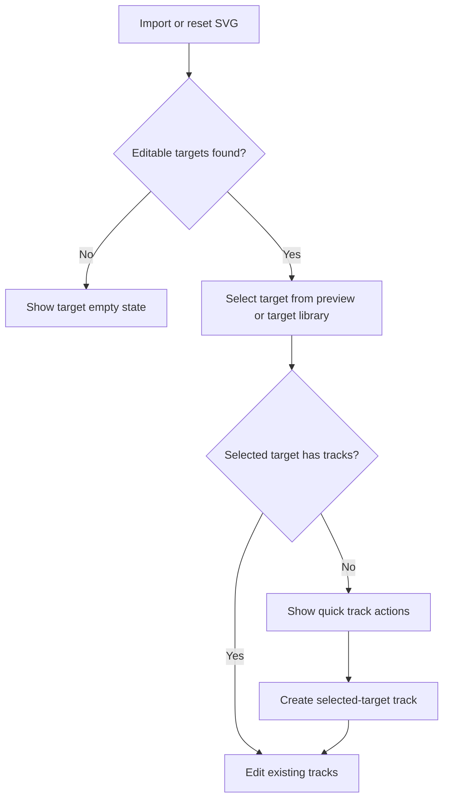

<!-- markdownlint-disable-next-line MD025 -->
# G6-001 - Rough UX Hardening

## Linked Issue

- [#11](https://github.com/flyingrobots/tadpole/issues/11)

## Roadmap Gate

- Goal 6: Rough UX Hardening

## Cycle Start

- [x] `git fetch origin` completed.
- [x] Local merge target branch synced to `origin/main` without rebase or force
      operations.
- [x] Cycle branch checked out from the synced merge target.
- [x] GitHub issue created from the `Tadpole Task` issue form.
- [x] `work-in-progress` label applied to the GitHub issue.
- [x] Design doc, issue link, and initial cycle scaffold staged and committed.
- [x] Branch pushed and PR opened to the merge target.

## Decision Summary

Goal 6 hardens the rough SVG timeline editor by making empty states explicit,
adding selected-target track shortcuts, improving imported target labels, and
adding recovery controls for track/SVG mismatch. This cycle keeps the single
screen editor shape and does not introduce a layer tree or undo stack.

## Sponsored Human

An SVG animator wants the editor to explain what can be edited next so that
rough project setup stays fast, without having to infer state from empty lists,
manual target selectors, or silent track reconciliation.

## Sponsored Agent

An agent needs stable visible labels, button names, and witness assertions so it
can verify UX state changes without scraping pixels or relying on private
component state.

## Hill

By the end of this cycle, a user can understand empty SVG/target/track states,
create common tracks directly from the selected SVG target, see clearer imported
target labels, identify the selected target near the preview, and clear tracks
when changing SVGs; the repo proves it with focused browser witnesses plus
`npm run check` and `npm run build`.

## Current Truth

- Goal 5 landed in
  [PR #10](https://github.com/flyingrobots/tadpole/pull/10), and
  `origin/main` is at merge commit
  [`48cc5948dd38f9659b190b98f7089f9c0e228fd9`](https://github.com/flyingrobots/tadpole/commit/48cc5948dd38f9659b190b98f7089f9c0e228fd9).
- The baseline editor imports raw SVG through
  [frontend/src/App.svelte#1062:48cc5948dd38f9659b190b98f7089f9c0e228fd9](https://github.com/flyingrobots/tadpole/blob/48cc5948dd38f9659b190b98f7089f9c0e228fd9/frontend/src/App.svelte#L1062),
  sanitizes SVG before rendering through
  [frontend/src/App.svelte#367:48cc5948dd38f9659b190b98f7089f9c0e228fd9](https://github.com/flyingrobots/tadpole/blob/48cc5948dd38f9659b190b98f7089f9c0e228fd9/frontend/src/App.svelte#L367),
  discovers editable targets through
  [frontend/src/App.svelte#340:48cc5948dd38f9659b190b98f7089f9c0e228fd9](https://github.com/flyingrobots/tadpole/blob/48cc5948dd38f9659b190b98f7089f9c0e228fd9/frontend/src/App.svelte#L340),
  exports project JSON through
  [frontend/src/App.svelte#866:48cc5948dd38f9659b190b98f7089f9c0e228fd9](https://github.com/flyingrobots/tadpole/blob/48cc5948dd38f9659b190b98f7089f9c0e228fd9/frontend/src/App.svelte#L866),
  and restores project JSON through
  [frontend/src/App.svelte#1422:48cc5948dd38f9659b190b98f7089f9c0e228fd9](https://github.com/flyingrobots/tadpole/blob/48cc5948dd38f9659b190b98f7089f9c0e228fd9/frontend/src/App.svelte#L1422).
- The SVG MVP roadmap checklist tracks Goal 6 as incomplete at
  [docs/method/design/svg-timeline-mvp/checklist.md#59:48cc5948dd38f9659b190b98f7089f9c0e228fd9](https://github.com/flyingrobots/tadpole/blob/48cc5948dd38f9659b190b98f7089f9c0e228fd9/docs/method/design/svg-timeline-mvp/checklist.md#L59).
- Existing browser witnesses cover SVG import safety at
  [docs/method/witness/svg-timeline-mvp/import-gate-smoke.mjs#70:48cc5948dd38f9659b190b98f7089f9c0e228fd9](https://github.com/flyingrobots/tadpole/blob/48cc5948dd38f9659b190b98f7089f9c0e228fd9/docs/method/witness/svg-timeline-mvp/import-gate-smoke.mjs#L70)
  and project export/restore behavior at
  [docs/method/witness/svg-timeline-mvp/project-export-smoke.mjs#58:48cc5948dd38f9659b190b98f7089f9c0e228fd9](https://github.com/flyingrobots/tadpole/blob/48cc5948dd38f9659b190b98f7089f9c0e228fd9/docs/method/witness/svg-timeline-mvp/project-export-smoke.mjs#L58),
  but they do not prove selected-target shortcuts or empty-state copy.

## Problem

The editor can edit any imported SVG target that has an ID, but the rough UX
still leaves common states implicit:

- An imported SVG with no editable targets leaves users with an inert target
  library.
- A selected target with no tracks does not offer direct next actions.
- Discovered target labels can be weak when SVGs lack `data-tadpole-name`,
  `aria-label`, or text content.
- The preview does not summarize the selected target near the visual surface.
- SVG changes reconcile tracks, but there is no explicit clear-tracks recovery
  action.

## Scope

This cycle includes:

- Empty states for missing SVG, missing targets, and selected targets with no
  tracks.
- Quick track creation actions scoped to the selected target.
- Better discovered target labels.
- A visible selected-target chip near the preview.
- A clear-tracks action for SVG changes.

## Non-Goals

This cycle does not include:

- Multi-select target editing.
- A layer tree or nested SVG hierarchy browser.
- Undo/redo history.
- Timeline presets or animation templates.
- Goal 8 runnable animation export.

## User Experience / Product Shape

The current single-screen editor remains intact. Goal 6 adds clearer local
states where users already look: the SVG source panel, target library, preview
heading, and selected-track/inspector area.



### Accessibility Considerations

New empty states must be plain text near the affected controls. New quick
actions must be real buttons with target and property names in their accessible
names. The selected-target chip must duplicate, not replace, existing target
library state.

## Runtime / API Contract

No exported package API changes. The user-facing contract is the DOM behavior of
the Svelte editor:

- Target library empty state appears when `availableTargets.length === 0`.
- Selected-target no-track state appears when a target is selected and no track
  exists for that target.
- Quick action buttons create tracks using the existing timeline track model.
- Improved labels are derived during SVG target discovery and exported in
  project target metadata.
- Clear-tracks action empties timeline tracks through existing in-memory state.

## Data / State Model

| State | Source of truth | Reset behavior |
| --- | --- | --- |
| SVG source | `svgSource` | Reset sample or successful import replaces it |
| Editable targets | Parsed SVG source | Recomputed on import/reset |
| Selected target | `selectedTargetId` | Settled against available targets |
| Timeline tracks | `tracks` | Reconciled on SVG load; clear action empties it |
| Export metadata | Reactive project export | Follows parsed targets and tracks |

## Security / Trust Boundary

SVG source remains untrusted input. Goal 6 does not expand the sanitizer
allowlist or permit new script, URL, style, SMIL animation, or external-resource
surfaces.

| Boundary | Posture |
| --- | --- |
| SVG markup | Sanitized before render; unsafe nodes and refs stay blocked |
| Target labels | SVG label fields are untrusted strings |
| Label rendering | Svelte text interpolation, never `{@html}` |
| Track clearing | Clears in-memory tracks only |
| Regression proof | Import-gate smoke remains the sanitizer guard |

## Accessibility Posture

| Surface | Requirement |
| --- | --- |
| Empty states | Text appears near affected control and is not visual-only |
| Quick actions | Buttons name target and property |
| Selected-target chip | Mirrors existing selected target state |
| Clear tracks | Button communicates destructive scope |

## Localization / Directionality Posture

| String or surface | Requirement |
| --- | --- |
| Empty-state copy | English inline strings in `App.svelte` |
| Quick action buttons | English inline strings name target and property |
| Selected-target chip | English inline string mirrors target name and ID |
| Catalog location | No i18n catalog exists yet |
| Directionality | Existing wrapping controls do not require LTR ordering |
| Locale updates | Not applicable until catalogs exist |

## Agent Inspectability

Browser witnesses can inspect stable text, button names, target chips, track
cards, and exported project JSON. No pixel-only assertion is required.

## Linked Invariants

- Tests and witnesses prove runtime behavior.
- Imported SVG state remains sanitized before rendering.
- Project export follows runtime truth.
- Commands change state; status copy only explains state.

## Design Alternatives Considered

### Option A: Full Layer Tree

Pros:

- Gives a structured view of all SVG targets.

Cons:

- Too large for Goal 6 and duplicates target library work.

### Option B: Local Hardening In Existing Panels

Pros:

- Small, testable, and keeps the current editor shape.

Cons:

- Does not solve deep SVG hierarchy navigation.

## Decision

Use Option B. Add local hardening to existing panels and defer layer-tree work
until after runnable export exists.

## Implementation Slices

- [x] Slice 1: Cycle scaffold and witness plan.
- [x] Slice 2: Empty states for missing SVG, missing targets, and selected
      targets with no tracks.
- [x] Slice 3: Quick selected-target track creation actions.
- [x] Slice 4: Better discovered target labels.
- [x] Slice 5: Selected-target chip near preview.
- [x] Slice 6: Clear-tracks action for SVG changes.

## Tests To Write First

- [x] Browser witness proves no-target SVG import shows a target empty state.
- [x] Browser witness proves a blank Raw SVG draft shows a missing-SVG empty
      state.
- [x] Browser witness proves selecting a target with no tracks exposes quick
      track actions and creates a bound track.
- [x] Browser witness proves imported unlabeled targets receive useful labels.
- [x] Browser witness proves selected-target chip and clear-tracks action when
      implemented.

## Proof Matrix

All Goal 6 proof rows are in `rough-ux-hardening-smoke.mjs` unless noted.

| Claim | Required proof |
| --- | --- |
| Blank Raw SVG explains the missing-SVG state | `runEmptyStateSmoke` |
| No-target SVG explains missing editable targets | `runEmptyStateSmoke` |
| No-track target offers quick actions | `runSelectedTargetQuickActionSmoke` |
| Quick actions create target tracks | `runSelectedTargetQuickActionSmoke` |
| SVG `<title>` improves discovered labels | `runTargetLabelSmoke` |
| Preview exposes selected-target state | `runSelectedTargetQuickActionSmoke` |
| Clear Tracks restores empty states | `runSelectedTargetQuickActionSmoke` |
| SVG import sanitizer remains guarded | `import-gate-smoke.mjs` |

## Acceptance Criteria

The work is done when:

- [x] Empty states are visible and covered by browser witness.
- [x] Quick selected-target track creation is covered by browser witness.
- [x] Target label improvements are covered by browser witness.
- [x] Selected-target chip and clear-tracks action are covered by browser
      witness.
- [x] `CHANGELOG.md` and roadmap checklist are updated.
- [x] `npm run check` and `npm run build` pass.

## Validation Plan

```bash
npm run check
npm run build
node docs/method/witness/svg-timeline-mvp/rough-ux-hardening-smoke.mjs
```

## Playback / Witness

Run the Goal 6 browser witness against the local dev server:

```bash
cd /tmp/tadpole-playwright
node /Users/james/git/tadpole/docs/method/witness/svg-timeline-mvp/rough-ux-hardening-smoke.mjs
```

## Risks

Known risks:

- More inline UI state can clutter the single-screen editor.
- Quick actions may duplicate existing track controls.

Mitigations:

- Keep copy short and colocated with the affected panel.
- Reuse the existing track creation path instead of adding a separate model.

## Follow-On Issues

- Layer-tree navigation is deferred. Create a dedicated GitHub issue if
  selected-target shortcuts are not enough for complex SVGs.

## Retrospective

Goal 6 implementation is complete. Keep this section open for PR review drift.

What changed from the design:

- The clear-tracks action landed in the SVG Source panel so it is colocated
  with SVG import/reset recovery controls.

What the tests proved:

- Browser witness proves empty states, selected-target quick track creation,
  SVG title-based target labels, the preview selected-target chip, and
  clear-tracks recovery.

What remains open:

- None for Goal 6. Goal 8 runnable animation export remains the next product
  gap.

PR:

- [#12](https://github.com/flyingrobots/tadpole/pull/12)
