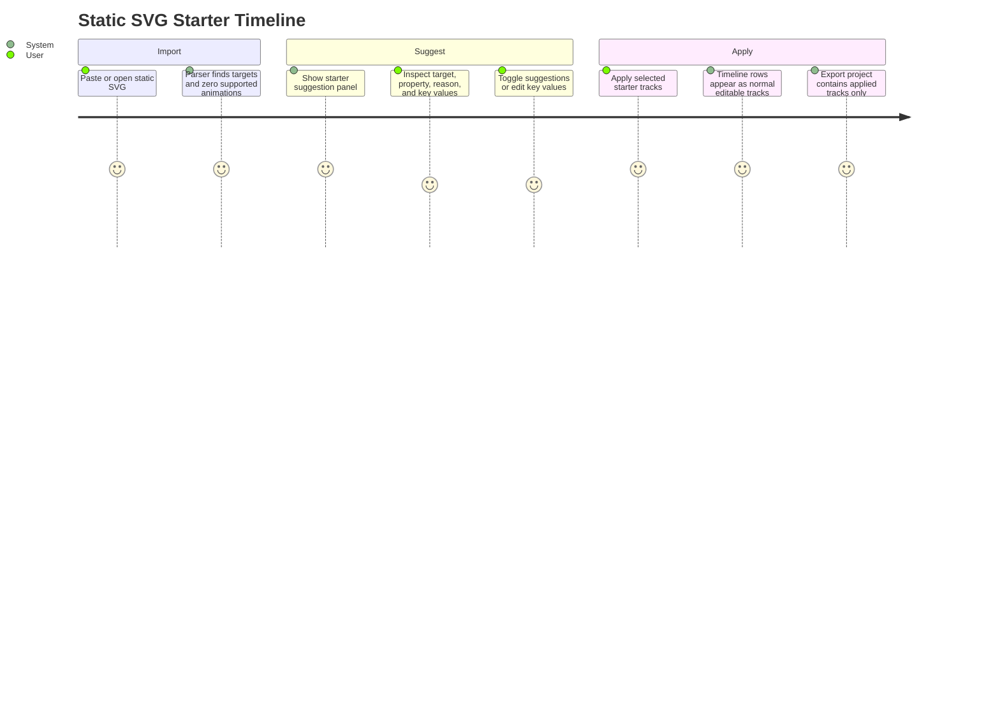
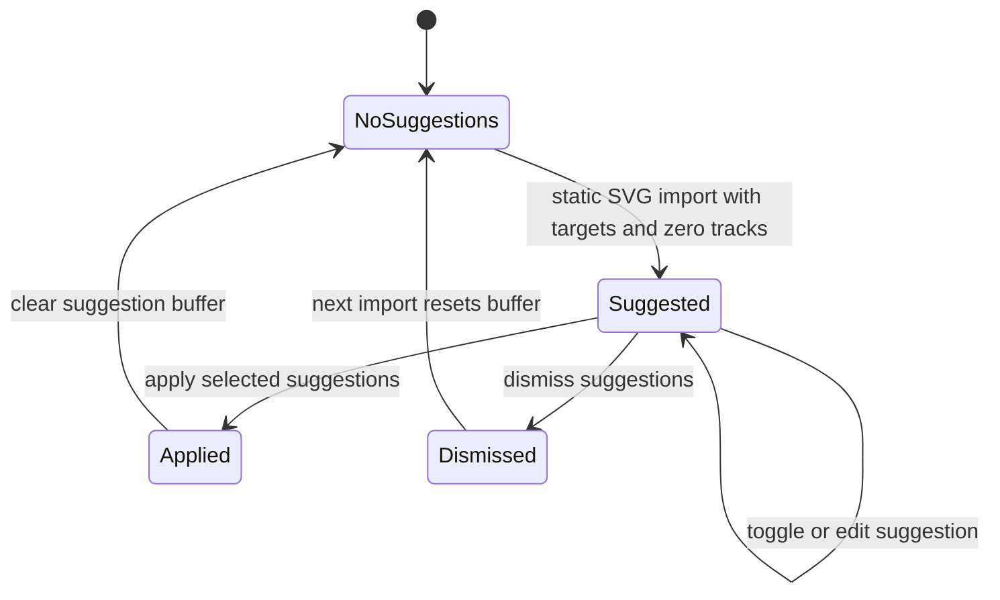

<!-- markdownlint-disable-next-line MD025 -->
# G21-001 - Static SVG Starter Timelines

## Linked Issue

- [#24 - COOL IDEA - Suggest starter timelines for static SVGs](https://github.com/flyingrobots/tadpole/issues/24)

## Decision Summary

Tadpole will add an optional starter-timeline suggestion surface for imported
SVGs that contain editable targets but no supported animation tracks. The
surface proposes deterministic, explainable candidate tracks from SVG target
facts and only mutates the timeline when the user applies selected suggestions.

## Sponsored Human

A visual designer wants a starting animation pass for a static SVG so that they
can begin editing a timeline quickly, without having to manually identify every
reasonable first track from a blank timeline.

## Sponsored Agent

An agent needs inspectable starter-suggestion facts so it can verify why a
track was proposed, without inferring intent from pixels or treating heuristic
motion as imported SVG truth.

## Hill

By the end of this cycle, a user can import a static SVG, inspect deterministic
starter timeline suggestions, reject or edit suggestions before applying them,
and the repo proves the workflow with a browser witness that reads suggestion
facts and exported project state.

## Current Truth

- SVG import currently extracts supported SMIL animation tracks when they
  exist and otherwise keeps compatible existing tracks. Evidence:
  [frontend/src/App.svelte#L2358:6c4ec25904a21b68e82cd92f8133a0611dbb567b](https://github.com/flyingrobots/tadpole/blob/6c4ec25904a21b68e82cd92f8133a0611dbb567b/frontend/src/App.svelte#L2358).
- Static SVGs with no compatible tracks render the existing empty timeline
  state. Evidence:
  [frontend/src/App.svelte#L5958:6c4ec25904a21b68e82cd92f8133a0611dbb567b](https://github.com/flyingrobots/tadpole/blob/6c4ec25904a21b68e82cd92f8133a0611dbb567b/frontend/src/App.svelte#L5958).
- SVG layer rows expose target id, parent id, label, kind, and depth as
  runtime-backed objects. Evidence:
  [frontend/src/SvgLayerRow.ts#L19:6c4ec25904a21b68e82cd92f8133a0611dbb567b](https://github.com/flyingrobots/tadpole/blob/6c4ec25904a21b68e82cd92f8133a0611dbb567b/frontend/src/SvgLayerRow.ts#L19).
- Goal 20 adds the docked shell and bottom timeline track visibility contract
  this surface will reuse. Evidence:
  [frontend/src/App.svelte#L5019:6c4ec25904a21b68e82cd92f8133a0611dbb567b](https://github.com/flyingrobots/tadpole/blob/6c4ec25904a21b68e82cd92f8133a0611dbb567b/frontend/src/App.svelte#L5019).

## Problem

When a static SVG has no supported animation nodes, Tadpole correctly avoids
inventing imported tracks, but the empty timeline leaves the user with no
guided first move even though the SVG already exposes useful structure such as
ids, names, target kinds, and hierarchy.

## Scope

This cycle includes:

- A deterministic starter-suggestion planner for static SVG imports.
- An inspectable suggestion surface in the bottom timeline empty state.
- Include/exclude controls for each suggestion.
- Editable suggested keyframe values before applying suggestions.
- A command-backed apply path that creates normal editable tracks.
- Browser witness coverage for suggest, reject, edit, apply, and export.

## Non-Goals

This cycle does not include:

- AI-generated motion.
- Pixel analysis, bounding-box geometry heuristics, or visual salience scoring.
- Multi-scene timelines.
- Curves editor changes.
- Treating suggestions as imported source animation.

## Runtime / API Contract

The starter timeline contract has these runtime-backed concepts:

- `StarterTimelineTargetFact`: target id, label, kind, parent target id,
  depth, and source order.
- `StarterTimelineSuggestion`: suggested target, property, reason, and editable
  keyframes.
- `StarterTimelinePlan`: ordered immutable suggestion list for a static import.
- `StarterTimelinePlanner`: deterministic planner from target facts to a plan.

Suggested tracks remain outside `tracks` until the user activates
`starterTimeline.applySelected`. Applying suggestions creates normal timeline
tracks through the existing command path.

## User Experience / Product Shape



The suggestion panel lives in the bottom timeline empty state because it is the
place where the absence of tracks is most visible. Each suggestion shows:

- target label and id,
- property label,
- deterministic reason,
- editable keyframe values,
- include checkbox,
- apply and dismiss actions.

## Data / State Model



| State | Source of truth |
| ----- | --------------- |
| Target facts | Parsed SVG layer rows |
| Suggestions | `StarterTimelinePlan` copied into app state |
| Selected suggestions | Set of suggestion ids |
| Applied tracks | Existing `tracks` timeline state |

Reset behavior:

- Target facts are rebuilt on each SVG import.
- Suggestions clear after apply, dismiss, sample reset, or animated import.
- Selected suggestions default to all suggestions selected.
- Applied tracks use normal command history and export behavior.

## Accessibility Posture

| Surface | Requirement |
| ------- | ----------- |
| Suggestion region | Region has stable label and count facts. |
| Include controls | Checkboxes expose selected state. |
| Keyframe value inputs | Each input names target, property, and keyframe time. |
| Apply/dismiss | Buttons remain keyboard reachable in timeline empty state. |

## Localization Posture

New visible strings are local English app copy. Tadpole does not yet have a
string catalog; no locale files are changed in this cycle.

## Agent Inspectability

The browser witness and future agents can inspect:

- `[data-tadpole-starter-timeline-suggestions]`
- `data-tadpole-starter-suggestion-count`
- `data-tadpole-starter-origin="heuristic"`
- `[data-tadpole-starter-suggestion-id]`
- `data-tadpole-starter-target-id`
- `data-tadpole-starter-property`
- `data-tadpole-starter-reason`
- `[data-tadpole-apply-starter-timeline]`

## Linked Invariants

- Runtime truth wins.
- Suggestions are not imported source truth.
- One SVG remains the saved document.
- Tests exercise the real UI and export state.
- Design docs do not prove implementation.

## Design Alternatives Considered

### Option A: Auto-apply starter tracks

Pros:

- Fastest first-run experience.

Cons:

- Violates source truth by silently inventing animation state.
- Makes undo and provenance unclear.

### Option B: Suggestion buffer before project state

Pros:

- Honest about heuristic origin.
- Lets users reject or edit before mutation.
- Easy for agents to inspect.

Cons:

- Requires one more user action.

## Decision

Choose Option B. Starter timelines are suggestions until explicitly applied.

## Implementation Slices

- [x] Slice 1: Add design doc and cycle tracking for Goal 21.
- [x] Slice 2: Add runtime-backed starter timeline planner classes.
- [x] Slice 3: Add failing browser witness for static SVG suggest/edit/apply.
- [x] Slice 4: Wire static import state into the timeline suggestion surface.
- [x] Slice 5: Validate, document, push, and open/update PR.

## Tests To Write First

- [x] Browser witness imports a static SVG and sees deterministic suggestions.
- [x] Browser witness toggles one suggestion off before apply.
- [x] Browser witness edits a suggested keyframe value before apply.
- [x] Browser witness applies selected suggestions and confirms exported project
      JSON contains only applied tracks and edited values.

## Acceptance Criteria

- [x] Static SVGs with no supported animation data show an optional suggestion
      affordance.
- [x] Suggestions are deterministic and explainable from inspectable SVG facts.
- [x] The user can accept, reject, or edit suggested tracks before project state.
- [x] Suggestions do not masquerade as imported animation truth.
- [x] Browser witness proves the workflow through rendered UI and exported
      project state.

## Validation Plan

```bash
npm run check
npm run build
TADPOLE_APP_URL=http://localhost:5173/ \
  node docs/method/witness/svg-timeline-mvp/static-starter-timeline-smoke.mjs
npx markdownlint-cli2 \
  docs/method/design/svg-timeline-mvp/static-svg-starter-timelines.md \
  CHANGELOG.md
git diff --check
```

## Playback / Witness

```bash
TADPOLE_APP_URL=http://localhost:5173/ \
  node docs/method/witness/svg-timeline-mvp/static-starter-timeline-smoke.mjs
```

The witness opens Tadpole, imports a static SVG fixture, verifies starter
suggestion facts, edits a suggested value, applies selected suggestions, and
reads project JSON export.

## Risks

Known risks:

- Suggestions may feel arbitrary if reasons are vague.
- Too many suggestions could crowd the bottom timeline.

Mitigations:

- Limit the initial planner to a small deterministic set.
- Show reasons directly in the UI and witness them.

## Follow-On Issues

- Add geometry-based motion suggestions after a bounding-box service exists.
- Add named starter presets once users validate the deterministic baseline.

## Retrospective

What changed from the design:

- The implementation stayed within the planned suggestion-buffer shape.

What the tests proved:

- The browser witness imports a static SVG, inspects heuristic suggestion facts,
  deselects one suggestion, edits a keyframe value, applies selected
  suggestions, and verifies project JSON contains only applied tracks.

What remains open:

- Geometry-aware suggestions and named presets remain follow-on work.

PR:

- [PR #54](https://github.com/flyingrobots/tadpole/pull/54)
