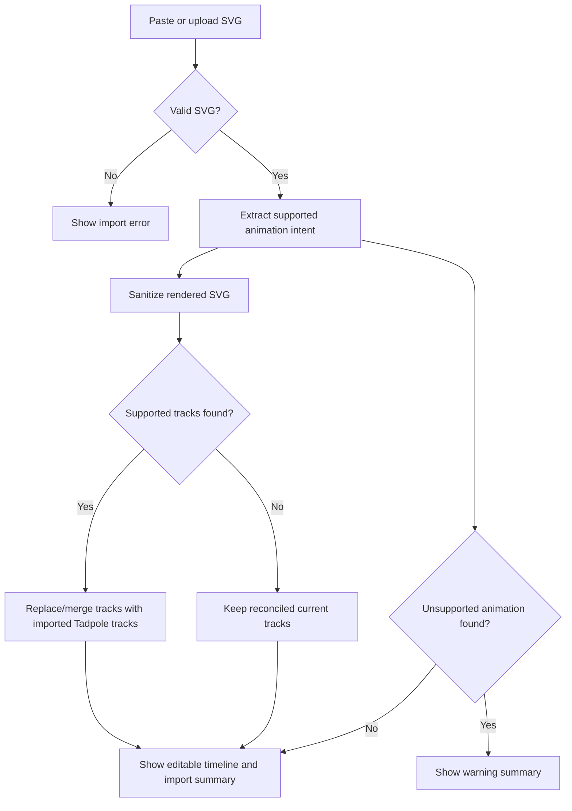
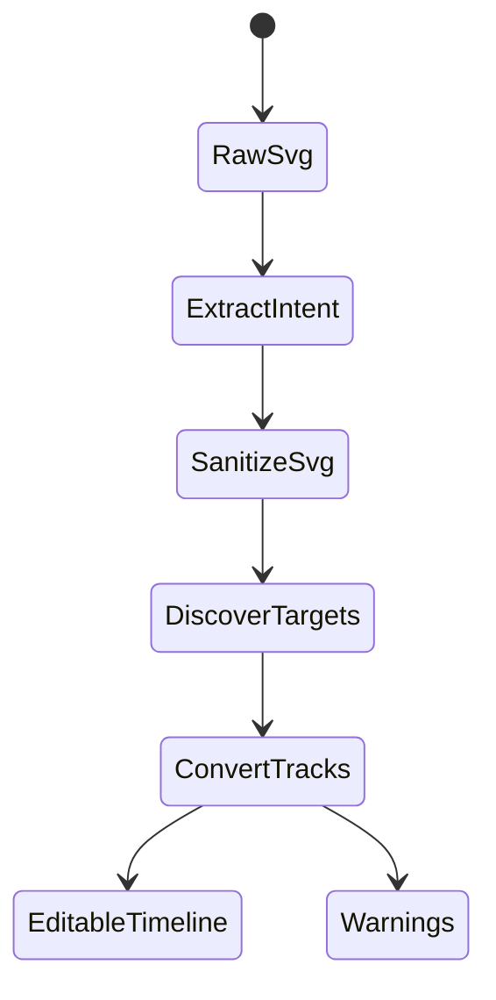

<!-- markdownlint-disable-next-line MD025 -->
# G9-001 - Import Existing SVG Animation Timelines

## Linked Issue

- [Issue #20](https://github.com/flyingrobots/tadpole/issues/20)

## Decision Summary

Tadpole will extract a small, safe subset of existing SVG animation data during
SVG import and convert it into editable Tadpole timeline tracks before the
sanitized SVG is rendered. The first supported contract is SMIL
`<animate>`/`<animateTransform>` for target IDs and properties that Tadpole
already edits. Unsupported CSS, script, and animation features are reported in
the editor instead of being executed or silently treated as imported tracks.

## Sponsored Human

A designer or engineer wants imported SVGs with existing motion to become
editable Tadpole tracks so that they can refine a logo or diagram timeline
without manually rebuilding every keyframe from the source file.

## Sponsored Agent

An agent needs an inspectable animation-import summary and project JSON track
output so it can verify imported motion through DOM state and serialized
project data, without scraping preview pixels or trusting unsafe SVG animation
nodes.

## Hill

By the end of this cycle, a user can paste or upload an SVG containing
supported SMIL animation nodes and Tadpole creates editable tracks/keyframes
through the existing SVG import surface, and the repo proves it with a browser
witness that imports, edits, scrubs, and exports the converted timeline.

## Current Truth

- `frontend/src/App.svelte` owns SVG source import, sanitization, target
  discovery, track state, and project/runnable export at
  [frontend/src/App.svelte#L216:8021a8c2acfdcfffb35b1d12ab624a81b5b9cdeb](https://github.com/flyingrobots/tadpole/blob/8021a8c2acfdcfffb35b1d12ab624a81b5b9cdeb/frontend/src/App.svelte#L216).
- The sanitizer currently removes SMIL animation nodes and style/script-like
  surfaces before rendering at
  [frontend/src/App.svelte#L217:8021a8c2acfdcfffb35b1d12ab624a81b5b9cdeb](https://github.com/flyingrobots/tadpole/blob/8021a8c2acfdcfffb35b1d12ab624a81b5b9cdeb/frontend/src/App.svelte#L217).
- Raw SVG import currently parses, sanitizes, discovers targets, and reconciles
  existing tracks at
  [frontend/src/App.svelte#L1411:8021a8c2acfdcfffb35b1d12ab624a81b5b9cdeb](https://github.com/flyingrobots/tadpole/blob/8021a8c2acfdcfffb35b1d12ab624a81b5b9cdeb/frontend/src/App.svelte#L1411).
- Project export includes sanitized SVG source, discovered targets, timeline
  settings, and tracks at
  [frontend/src/App.svelte#L1197:8021a8c2acfdcfffb35b1d12ab624a81b5b9cdeb](https://github.com/flyingrobots/tadpole/blob/8021a8c2acfdcfffb35b1d12ab624a81b5b9cdeb/frontend/src/App.svelte#L1197).
- Goal 9 is the current open loop in
  [BEARING.md#L49:8021a8c2acfdcfffb35b1d12ab624a81b5b9cdeb](https://github.com/flyingrobots/tadpole/blob/8021a8c2acfdcfffb35b1d12ab624a81b5b9cdeb/BEARING.md#L49).

## Problem

Opening an SVG with existing animation currently strips animation nodes as part
of the import trust boundary, leaving the user with a safe but static SVG and
no editable timeline tracks derived from the source motion.

## Scope

This cycle includes:

- Extract supported SMIL `<animate>` nodes for `opacity`, `fill`, `stroke`, and
  `stroke-width`.
- Extract supported SMIL `<animateTransform>` nodes for `translate`, `scale`,
  and `rotate`.
- Resolve targets from local `href`/`xlink:href` or from the animation node's
  parent element ID.
- Convert `values` or `from`/`to` pairs plus `dur` and optional `keyTimes` into
  Tadpole keyframes.
- Parse SVG clock values with SVG semantics, including unitless timecounts as
  seconds.
- Interpolate imported fill/stroke color tracks when values are supported CSS
  hex or RGB colors.
- Keep sanitized SVG output free of animation nodes.
- Show imported-track counts and unsupported-animation warnings in the SVG
  Source panel.
- Prove the flow with a browser witness.

## Non-Goals

This cycle does not include:

- Full SMIL fidelity for path motion, additive composition, begin offsets,
  repeats, accumulative animation, or non-linear timing functions.
- Executing or preserving `<style>`, script, event handlers, or Web Animations
  JavaScript.
- AI-generated or heuristic starter timelines for static SVGs.
- Undo/redo for import reconciliation.
- Layer-tree or multi-select target editing.

## User Experience / Product Shape

The user keeps using the existing SVG Source panel. When imported SVG markup
contains supported animation nodes, Tadpole removes those nodes from the
rendered SVG and creates normal editable tracks in the timeline. The source
panel status names how many tracks were imported. If the SVG contains
unsupported animation features, the panel shows a warning list that can be
read without inspecting raw SVG.



### Accessibility Considerations

Import summaries and unsupported-animation warnings are rendered as text inside
the existing SVG Source panel with polite or assertive live-region behavior.
Converted tracks use the existing timeline, keyboard, and inspector controls.

## Runtime / API Contract

Name: `svg-animation-import-1`

Supported input contract:

<!-- markdownlint-disable MD013 -->
| Source node | Required data | Tadpole output |
| ----------- | ------------- | -------------- |
| `<animate>` | target ID, supported `attributeName`, `dur`, `values` or `from`/`to` | One property track |
| `<animateTransform type="translate">` | target ID, `dur`, two values | `x` and/or `y` tracks |
| `<animateTransform type="scale">` | target ID, `dur`, two values | One `scale` track |
| `<animateTransform type="rotate">` | target ID, `dur`, two values | One `rotation` track |
<!-- markdownlint-enable MD013 -->

Unsupported input behavior:

- Unsafe or external target references are ignored and warned.
- Unsupported animation attributes are ignored and warned.
- Non-linear or discrete `calcMode` values are ignored and warned until Tadpole
  has a timeline representation that preserves them faithfully.
- Non-uniform scale, pivoted rotate, finite repeat, malformed or overlong
  transform values, additive/accumulated composition, and non-interpolable color
  values are ignored and warned.
- Imported loop state comes from SVG repeat intent: `repeatCount="indefinite"`
  loops, while one-shot animation imports do not.
- CSS animation and Web Animations script surfaces remain non-executed and are
  warned when detectable.
- The sanitized SVG source never keeps SMIL animation nodes.

## Data / State Model

<!-- markdownlint-disable MD013 -->
| State | Source of truth | Reset behavior | Serialization |
| ----- | --------------- | -------------- | ------------- |
| Sanitized SVG source | `svgMarkup` | Replaced on import/reset | Project and runnable exports |
| Discovered targets | Parsed sanitized SVG | Recomputed on source change | Project export |
| Imported tracks | Extracted pre-sanitization animation intent | Replaced by next SVG import with imported tracks | Project and runnable exports |
| Import warnings | Last SVG import result | Cleared on valid import without warnings or reset | UI only |
<!-- markdownlint-enable MD013 -->



## Accessibility Posture

| Concern | Posture |
| ------- | ------- |
<!-- markdownlint-disable MD013 -->
| Semantic labels or facts | Import count and warning text are rendered in the SVG Source panel. |
| Focus order | No new focus surface is required for the first import contract. |
| Hidden or visual-only facts | Unsupported animation warnings are text, not color-only markers. |
| Keyboard behavior | Imported tracks use existing timeline keyboard controls. |
| Secret/redaction behavior | Not applicable. Imported SVG remains untrusted and sanitized. |
<!-- markdownlint-enable MD013 -->

## Localization / Directionality Posture

New visible strings are English-only like the existing prototype UI. Strings
are kept short and neutral, and no bidi-sensitive formatting beyond target IDs
is introduced.

| String Area | Location | Directionality Assumption |
| ----------- | -------- | ------------------------- |
<!-- markdownlint-disable MD013 -->
| Import status | `frontend/src/App.svelte` SVG Source panel | Inherits document direction |
| Warning list | `frontend/src/App.svelte` SVG Source panel | Target IDs render as plain text |
<!-- markdownlint-enable MD013 -->

## Agent Inspectability / Explainability Posture

- Import results are visible as text in the source panel.
- Converted tracks appear in existing `.track-card` DOM nodes.
- Project JSON export includes converted tracks and keyframes.
- Browser witnesses can assert sanitized SVG lacks SMIL nodes while exported
  project JSON includes Tadpole tracks.

## Linked Invariants

- Runtime Truth Wins
- Tests Are the Spec
- Commands Change State, Effects Do Not
- Layout Owns Interaction Geometry
- Docs Are the Demo

## Design Alternatives Considered

### Option A: Preserve SMIL Nodes

Pros:

- High fidelity for SVGs that already animate in browsers.

Cons:

- Conflicts with the existing sanitizer boundary.
- Does not make the timeline editable.
- Keeps execution behavior in imported untrusted markup.

### Option B: Convert A Safe Subset To Tadpole Tracks

Pros:

- Produces editable tracks.
- Preserves the existing sanitizer boundary.
- Gives clear room to widen support with tests.

Cons:

- Does not preserve every animation feature.
- Requires visible unsupported-feature reporting.

## Decision

Choose Option B. Goal 9 ships a safe conversion subset and makes unsupported
features explicit. The supported subset can expand after the parser and witness
contract exist.

## Implementation Slices

- [x] Slice 1: Add this design packet and link Goal 9 to issue #20.
- [x] Slice 2: Extract supported SMIL animation intent before sanitization.
- [x] Slice 3: Convert supported intent into normalized Tadpole tracks and import
      warnings.
- [x] Slice 4: Wire imported tracks and warnings into the SVG Source panel.
- [x] Slice 5: Add a browser witness that imports, edits, scrubs, and exports
      converted tracks.
- [x] Slice 6: Update checklist, changelog, BEARING, witness docs, issue, and PR.

## Tests To Write First

Behavior tests required:

- [x] Browser witness imports SVG SMIL into editable Tadpole tracks.
- [x] Browser witness proves sanitized preview contains no SMIL animation nodes.
- [x] Browser witness edits an imported keyframe and sees project export update.
- [x] Browser witness reports unsupported animation constructs.
- [x] Browser witness proves unitless SMIL clock values import as seconds.
- [x] Browser witness proves unsupported `calcMode` values do not import as
      linear tracks.
- [x] Browser witness proves failed file imports clear stale animation warnings.
- [x] Browser witness proves unsafe animation references do not retarget to
      parent elements.
- [x] Browser witness proves one-argument `translate` imports as x-only motion.
- [x] Browser witness proves imported hex colors interpolate at the playhead.
- [x] Browser witness proves non-uniform scale and pivoted rotate imports warn
      instead of changing motion.
- [x] Browser witness proves finite repeat and malformed transform imports warn
      instead of shortening or inventing motion.
- [x] Browser witness proves RGBA color values, overlong transform arity, and
      composed SMIL animations warn instead of importing lossy motion.
- [x] Browser witness proves one-shot animation imports clear looping while
      indefinite imports preserve looping.

Documentation/process tests:

- [x] Markdown lint passes for changed docs.
- [x] `git diff --check` passes.

## Acceptance Criteria

The work is done when:

- [x] Supported SMIL import creates editable Tadpole tracks.
- [x] Unsupported animation data is visible to the user.
- [x] Sanitized preview/export does not retain animation nodes.
- [x] Project JSON export preserves converted tracks.
- [x] Browser witness covers import, edit, scrub, and export.
- [x] Browser witness covers unitless clock values, unsupported discrete timing,
      and failed-import warning cleanup.
- [x] Browser witness covers unsafe reference rejection and x-only translate
      import semantics.
- [x] Browser witness covers color interpolation and stricter transform/repeat
      rejection.
- [x] Browser witness covers RGBA rejection, transform arity rejection,
      composition rejection, and imported loop intent.
- [x] Local validation is green.

## Validation Plan

```bash
npm run check
npm run build
node docs/method/witness/svg-timeline-mvp/animation-import-smoke.mjs
npx --yes markdownlint-cli2 \
  CHANGELOG.md \
  BEARING.md \
  docs/method/design/svg-timeline-mvp/checklist.md \
  docs/method/design/svg-timeline-mvp/svg-animation-timeline-import.md \
  docs/method/witness/svg-timeline-mvp/animation-import.md \
  docs/method/retro/svg-timeline-mvp/retro.md
git diff --check
```

## Playback / Witness

Run the browser witness against a local dev server:

```bash
npm run dev
TADPOLE_APP_URL="${TADPOLE_APP_URL:-http://localhost:5173/}" \
  node docs/method/witness/svg-timeline-mvp/animation-import-smoke.mjs
```

## Risks

Known risks:

- SVG timing semantics are richer than Tadpole's current timeline model.
- Import warnings can become noisy on complex SVGs.
- Adding importer logic inside `App.svelte` increases the monolith until issue
  #17 is addressed.

Mitigations:

- Start with a small supported subset.
- Warn instead of pretending unsupported features imported.
- Keep parser helpers pure and easy to extract later.

## Follow-On Issues

- [Issue #17](https://github.com/flyingrobots/tadpole/issues/17)
- [Issue #21](https://github.com/flyingrobots/tadpole/issues/21)
- [Issue #22](https://github.com/flyingrobots/tadpole/issues/22)
- [Issue #23](https://github.com/flyingrobots/tadpole/issues/23)
- [Issue #24](https://github.com/flyingrobots/tadpole/issues/24)
- [Issue #25](https://github.com/flyingrobots/tadpole/issues/25)

## Retrospective

Fill this in after implementation.

What changed from the design:

- The implemented subset supports SMIL `<animate>` for opacity/fill/stroke/
  stroke-width and `<animateTransform>` for translate/scale/rotate. CSS and Web
  Animations are warning-only, as planned.
- The browser witness uses Vite's fallback port when `5173` is already occupied.

What the tests proved:

- `animation-import-smoke.mjs` imports five supported SMIL-derived tracks,
  reports three unsupported animation notes, proves sanitized preview/export do
  not retain animation/style/script nodes, scrubs imported motion, edits an
  imported keyframe, observes the edited value in project JSON, proves unitless
  SMIL clock values import as seconds, rejects unsupported discrete timing as a
  warning, clears stale warnings after failed file import, rejects unsafe
  animation references without parent retargeting, and imports one-argument
  `translate` as x-only motion. Follow-up review hardening added proof for
  imported color interpolation, non-uniform scale rejection, pivoted rotate
  rejection, finite repeat rejection, malformed transform rejection, RGBA
  rejection, overlong transform arity rejection, composition rejection, and
  imported loop intent.

What remains open:

- Full SMIL fidelity, CSS animation conversion, Web Animations extraction,
  static SVG starter timeline suggestions, layer navigation, undo/redo, and
  multi-select target editing remain follow-on work.

PR:

- [PR #26](https://github.com/flyingrobots/tadpole/pull/26)
