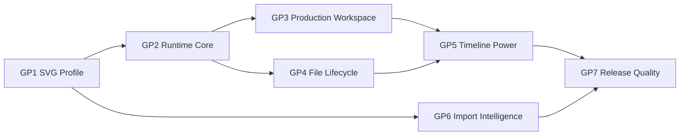

<!-- markdownlint-disable-file MD025 -->

# V1 Completion Roadmap

## Decision Summary

Tadpole is now an MVP-plus SVG timeline editor. The v1 completion roadmap
defines seven goalposts that turn the current working editor into a tool that
can be called complete: documented SVG support, extracted core architecture,
production workspace UX, native file lifecycle, deeper timeline editing,
intelligent import help, and release quality.

Each goalpost has one umbrella GitHub issue. Associated story issues are
collected as checklist children in the umbrella issue body.

## Goalposts

| Goalpost | Slice budget | Umbrella issue | Design doc |
| --- | ---: | --- | --- |
| GP1: SVG Animation Profile And Corpus | 18 | [#58](https://github.com/flyingrobots/tadpole/issues/58) | [gp1-svg-animation-profile-and-corpus.md](gp1-svg-animation-profile-and-corpus.md) |
| GP2: Runtime Core Extraction | 20 | [#59](https://github.com/flyingrobots/tadpole/issues/59) | [gp2-runtime-core-extraction.md](gp2-runtime-core-extraction.md) |
| GP3: Production Workspace And Docking UI | 22 | [#60](https://github.com/flyingrobots/tadpole/issues/60) | [gp3-production-workspace-and-docking-ui.md](gp3-production-workspace-and-docking-ui.md) |
| GP4: Native File Lifecycle | 18 | [#61](https://github.com/flyingrobots/tadpole/issues/61) | [gp4-native-file-lifecycle.md](gp4-native-file-lifecycle.md) |
| GP5: Timeline Editing Power Tools | 26 | [#62](https://github.com/flyingrobots/tadpole/issues/62) | [gp5-timeline-editing-power-tools.md](gp5-timeline-editing-power-tools.md) |
| GP6: Intelligent Import Repair And Starter Motion | 20 | [#63](https://github.com/flyingrobots/tadpole/issues/63) | [gp6-intelligent-import-repair-and-starter-motion.md](gp6-intelligent-import-repair-and-starter-motion.md) |
| GP7: Release Quality And Packaging | 16 | [#64](https://github.com/flyingrobots/tadpole/issues/64) | [gp7-release-quality-and-packaging.md](gp7-release-quality-and-packaging.md) |

Total planned slice budget: 140 slices.

## Sequencing

## Completion Gate

Tadpole v1 is complete when:

- [ ] Supported SVG animation semantics are documented and fixture-proven.
- [ ] Importer and serializer behavior live in runtime-backed core modules.
- [ ] The workspace is canvas-first, docked, and stable across screen sizes.
- [ ] Open, Save, Save As, dirty-state, and recovery flows feel native.
- [ ] Timeline editing supports high-density animation workflows.
- [ ] Suggested and repaired animation data never masquerades as imported
      source truth.
- [ ] A single validation command and release checklist prove v1 readiness.
